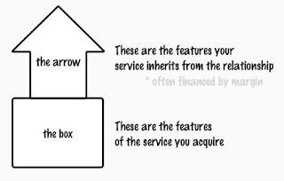

# The Box and The Arrow.

*Published 2026-01-28 · Labels: Services*  
*Source: <https://visible-quality.blogspot.com/2026/01/the-box-and-arrow.html>*

---

A lot of what I used to write in my blog, I find myself writing as a LinkedIn post. That is not the greatest of strategies given the lack of permanence to anything you post there, so I try to do better.

My big insight last week: the box and the arrow. Well, this is actually D and R from DSRP toolset for systems thinking applied to value generation.
In an earlier place of work when I hired consultant, they came with very different ideals of hour reporting that then mapped to cost.

One invoiced always full hours unless sick. Being a CEO of their own company, I am sure their days included something (if nothing else, tiredness) other than our work, but I had their attention and was happy with the outcomes. I framed it as "pay for value".

One invoiced always half hours, but produced as much value as the first one. They wanted to emphasize that the other work they did for service sales, upskilling themselves, and common tools development they used but help IP for wasn't ours to pay for. That was fine too, and I framed it as "unique access to top talent for our benefit".

One invoiced 100% of hours, including hours their company used on managing them. No other responsibilities, their work existence was in service of us. That too was fine, made it simple for them to make sense of shaping their capabilities. I framed that as "do you even want to keep them if they are not getting trained/coached".

The cost to value for these three was very different, depending on what I got in the service for free.

So I have modeled now the box and the arrow. The box is the service. The arrow is the relationship that transforms the service. One of the things in our arrow is how we collect information, in 2025 we interviewed more than 1,800 business and technology executives. This is not a "fill this questionnaire". This is us sending our top management to discuss things with a lot of people, every day of the year, systematically.
Listing things I consider our arrow that are easy to copy wouldn't be fair for me to do. But the list is long. And a lot of that work in the arrow is paid from whatever the margins enable.

  

We need better ways of comparing services. Maybe, just maybe, the question of "what you give us for free" is more insightful than I first thought.

A simplified analogy to why people shop at Prisma or Citymarket: the smiling greeting. It does not change the sausage they buy, but it changes their experience while buying the sausage.
