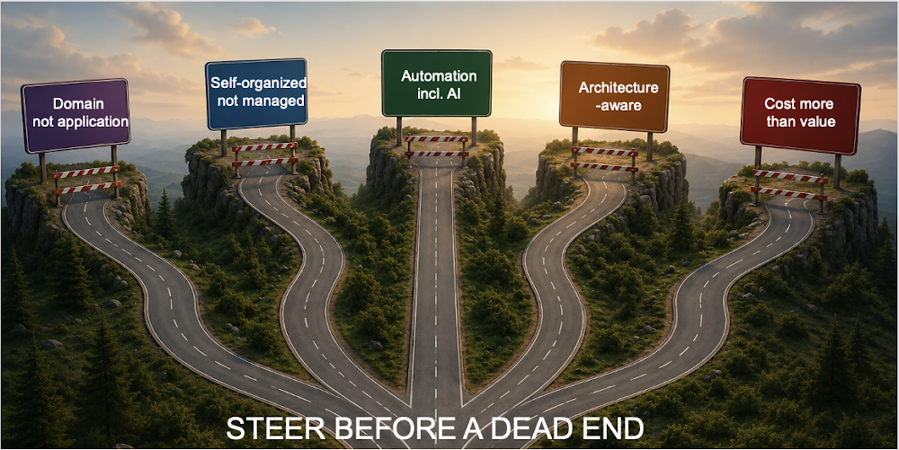

# Growing trees, today

*Published 2026-05-18, updated 2026-07-29*  
*Source: <https://visible-quality.blogspot.com/2026/05/growing-trees-today.html>*

---

It was May 25th 2015 and I was angry, frustrated and felt disconnected from the software industry. I made frequent remarks on preferring to work at McDonald's. I remember, because emotional resonance outlasts the specific detail of any interaction, and the overwhelming interaction on that day at XP2015 conference was the death of testing as I knew it.

In hindsight, the feelings of that time were my personal driver to reposition myself in testing. I learned *unit testing*, particularly *exploratory unit testing*, shifted a lot of my test automation considerations down the stack and started working with developers rather than testers on quality.

Ten years later, I claim I made right choices for my career in testing. I found impacts I could not have made without the developer collaboration aspect. I learned things I was convinced I did not want to or need to learn, on the side of doing things in teams that I felt strongly about.

Testing is far too wide and versatile to be dying, and it may be that was not what people said. I heard that because the message was not one I was welcoming or expecting, and news even if true can cause us to reject them.

I learned to frame things differently. I learned that *the future is already here, it is just not equally divided* and that sources of inspirations for experiments that grow both me and the project I contribute in are plentiful. Themed microlearning on the job allowed me to change the frame in which I worked, and learn about the past fears that had prevented me from embracing the developer I had become in my teenage years.

I remembered that feeling and that day, because today I have been the person making others feel like I did on that day. I told people that industry has already changes so that:

- More architecture-aware approaches to testing are required. You may not know what your UI tech is, but you can start today, ask and learn what are the typical technology-specific risks to it.
- You get to manage your own work, not expect someone else to be the manager pointing you to your work. The siloed roles within testing are breaking down.
- You can't remain an expert of a single system, you are expected to be able to compare, contrast and reuse in domain, and across domains.
- You need to tell about the value of your work. No, being modest and not explaining the dynamics of value unique to testing just don't cut it.
- Programming in testing, particularly with AI in the picture, is here and you won't make it ten years to retirement avoiding it. You should find your touchpoint to it.

My message of today about the dead ends and steering away from those isn't late for people who did not hear it or find constructive ways of microlearning back when I did. Consultancies, in particular, tend to make their money from having people who are in demand, and not having people would be bad business.

Yet you should, probably, think about this with the famous idea of when would you plant a tree to grow it. Prefererably 10 years ago if you need the tree today. But the second best option is today.

30 minutes of reflection on how you can be better tomorrow on the work you do now, identifying the variables you can tweak and doing on the job microlearning on a theme you choose for a period of time can take you a lot further than expecting a full training day at some point.

I forgot who made me feel bad in 2015, I only remember the feeling. And I can wish the same to be true for the people who had to hear the harsh messages today, that the industry has been giving this heads up on what is needed for quite some time, and we need to work on that future that is more equally distributed, because the clients at large want to see their value, impact and productivity evolve to the potential (and beyond).
