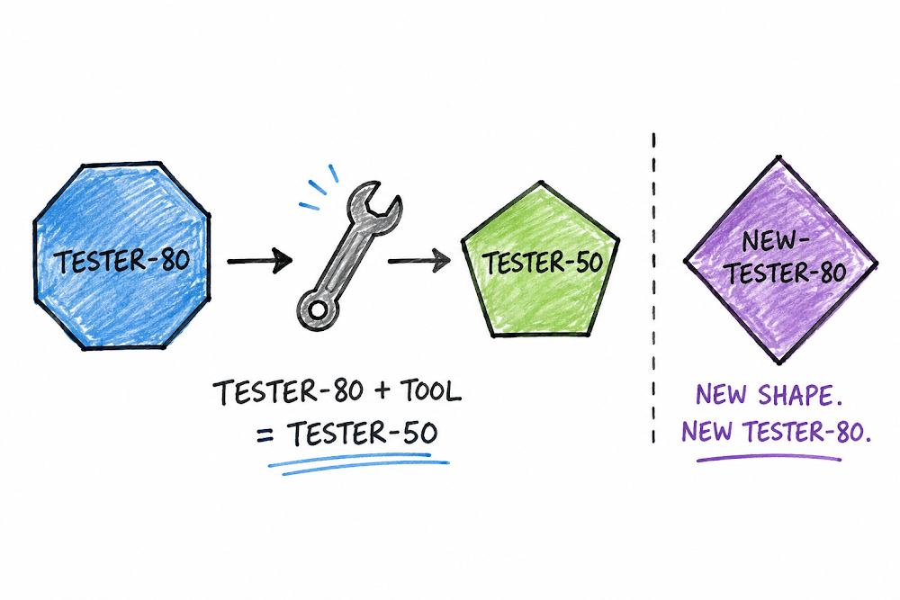
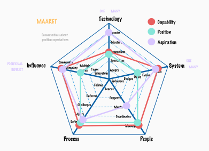

# Demand increases when the price point goes down

*Published 2026-06-07, updated 2026-07-29*  
*Source: <https://visible-quality.blogspot.com/2026/06/demand-increases-when-price-point-goes.html>*

---

A colleague at work had a broadband installed for their house this week, making the running joke of the week:

> How many people does it take to install a broadband?

The empirically validated number appeared to be 5 distinct individuals showing up at site. For a end user price point of 99 €.

Evidently, if that is a great business, someone else paid most of the cost. It was also a great example of organizing work to be done by as many people as it felt possible, specializing in tasks towards the end result.

The running joke become the brain worm of the week for me, for the parallels that I struggle with in testing. Clients want to get testing done, for whatever their equivalent of 99 € is. If we need to send in separately project manager who allows for testing to happen, a test manager who organizes the frame, the tester who knows what to do in the frame, and the test automator who leaves something behind for repeating, not all these roles can get a professional level salary without someone invisible in the chain subventing the costs. And unlike with broadbands in Finland, we don't have one of those for testing in Finland.

On an individual level, the test lead colleagues who don't test themselves but hold space for testing, creating some of the best environments to test in with positive feedback and continous acknowlegment of the unique challenges of testing, they are worth a lot. On a structural level, clients are increasingly asking not to have to pay as much for *management* and taking control over the choices by choosing individuals excluding these.

There will always be some test leads, especially for end-to-end systems over multiple systems, teams and even organizations. Yet the reshaping trend, and declining numbers of this specialization are visible at large.

The demand drives the shapes of "testers". The demand comes often attached to low price points. Like this week, a tester deep into the agentic style of testing, with five years of test automation centric test experience, for 50 € / hour. Must live in Finland and speak fluent Finnish. While I would be qualified for the tasks, my price point is somewhat more than double to that, and as much as I would have been a great person for that project, I wasn't ready to cut my salary yet.

Now with AI in the picture, the shapes of our roles are changing even more. We'd rather pay 50 € / hour for someone who is seriously supported by the tool bringing in a new generation of testers that are AI native. The 80 € / hour AI native testers need to find words to describe their value-adding shape.

If the World Economic Forum Future of Work -report says 92 millions jobs are lost to AI by 2030, and 170 million new jobs are generated in the same timeframe, it says the position shapes are changing.

As an individual, I look at three dimensions in building myself up:

- *Capability* is what I can do, and I can always get better in all dimensions of capability. Some grow with new skills, some by honing existing skills to efficiency of execution. It took me 10 repeats of transforming organizations to continuous releases before I felt I had the foundation of repeating this properly in place.
- *Position* is what organization expects me to do, and more often than not, we may be more in some dimension than our position is. This is the conversation of "I can do more, shouldn't I be paid more" where you need a different position to be paid more. Organizations tend to set pay for position, not for person. In best cases the two match.
- *Aspiration* is what you would want to do given the choices. Like the fact that I would like to be a developer even when I am a director, and I get snappy when someone suggests that I need a "developer" to tell how to do a thing I am an expert on. If aspiration and position are misaligned, there is a chance the work of the position doesn't get done, so I have always found it imporant to own my responsibility to a position, while visualizing and working towards my aspiration.

It's now been 10 years since Geoffrey Hinton in 2016 said:

> "It's just completely obvious that within five years, deep learning is going to do better than radiologists. ... We should stop training radiologists now." -- Geoffrey Hinton

10 years later, radiologist salaries are up by 40% and total amount of them is up by 15% (in USA). The demand went up. The shapes that gets compared are probably different in the tasks. This is an example of the Jevons paradox, where added efficiency increases demand.

We need to start doing better in talking about value and added efficiency in testing. However, counting "testers" might not work same as radiologists, because the trend last 10 years has shown that "testers" title gets merged with developers. We need to start getting counted as one relevant group.

Some also say that we have same amount of chefs but more kitchens, demand increasing but key productive resource not increasing. With AI through, it might be that task expansion brings in more chefs, and not all chefs need to be winning michelin stars with their cuisine.
