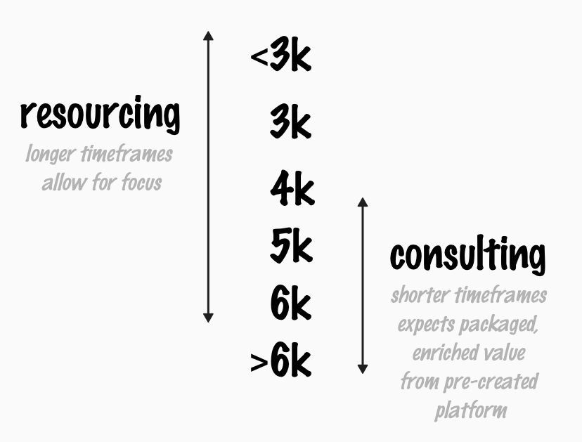

# Market changes our salaries

*Published 2026-06-08, updated 2026-07-29*  
*Source: <https://visible-quality.blogspot.com/2026/06/market-changes-our-salaries.html>*

---

There was a job posting for what appeared to be a challenging quality engineering / testing role, and a clearly defined phone time to ask about the role. So I called to ask a few things.

- why was the position 1 year contract rather than continuous - because they wanted a longer trial period to see if the new-to-organization role would be valuable
- would the salary range of the position make it a pay cut if I considered - it indeed would, and I got the understanding that it would be about 25%.

The real reason I called is that it was from an organization that I got to consult with for a few weeks with my lovely current employer allowing me to work with probably half the invoicing per hour to create throughput metrics as my first assignment, and I have hoped to be allowed to focus on that particular organization ever since.

So I had to check. The google AI summary tells me today that "a principal quality engineer earns €6250 - €8750 per month". They were hoping for the lower end of that scale.

Today's phone call was a reminder that have, salary-wise, grown to a scale in which I rarely get to stay around full time for a longer timeframe, but I show up with similar topics in many organizations, driving changes that people hired for the lower end salary don't always get done. It reminded me that for an above expected salary, my last three positions have been tailor-made for me, rather than be ones where I would be able to apply for an open position. I have been lucky to be surrounded with multiple organizations already who have done that for me.

Moving from me to the phenomena this makes me investigate: we are living in a world where a lot of people acquiring attention of talent believe we can now buy that attention for a lot cheaper, and require more on all levels. For me this shows up as desperately seeking testers, but not finding the right kind of testers (who are also developers). It shows up as talent salary levels confusion, that I can't quite wrap my head around every day.

I realized that for this position they fill, they hire someone who proposes hiring me for a few days at a time to help. And I never get to focus on a single client if I want to stick with the higher end of salaries.

Where I work, we are all called consultant, but not all of us really do consulting. And some of us who do, hope we wouldn't need to. But I guess that is the market valuation of paying for a kind of work.
