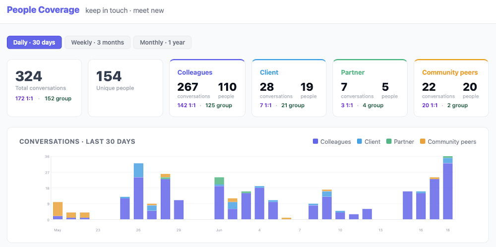

# The Numbers and the Stories

*Published 2026-06-18, updated 2026-07-29*  
*Source: <https://visible-quality.blogspot.com/2026/06/the-numbers-and-stories.html>*

---

Some days, I specialize in testing. Well, that and AI, and both of these two anchors have been quite equally balanced in my day to day work for quite some time. Other days I feel like I specialize in close to obsessive counting, and storytelling.

I wanted to make a not of three numbers and stories today.

## One: 30 % improvement in cost of testing services

Nine months ago, I was deep into defining SLAs (promises we keep, with numbers) and metrics (numbers that help us steer), and the work was not always smooth without friction. In addition to the intellectual challenge that setting goals of what we would collaboratively want to see with a client, many of the things I wanted to promise for visibility would require work to build up to.

Some of the motivation for needing a more wide range of perspectives through numbers came from the fact that I was driving a testing service transformation. Cutting 20 % and more from an established level of testing, but also moving it from management and process heavy towards lighter in management layers, and automation-centric.

Even if the frame of changes and the metrics that govern it are my design, the work has involved tens of people. And the numbers today tell us:

We cut down the testing by 30% (>4 FTE) and raised quality. We put through more improvements than before. We don't miss out on the features, not building automation for the changes. We are not done yet, but we are better on the way.

We've well scratched the surface of AI, but the cost savings are structural, not AI. And with the two put together in a learning investment that takes the people along the ride, I am convinced this client will see 50% cost cutting from the traditional and established baseline.   
/Users/maaretp/Desktop/Screenshot 2026-06-24 at 6.11.38.png  
Can I just anonymously celebrate getting here with a year of follow-up focus, after a design intensive of a few months?

## Two: 25 000 € / year bug identified on time

On even more personal note, I have been allowed to volunteer as a tester in another client's project. The tester's work was scheduled a few months down the road in the project, but of course I would, true to any shift left ideals with sense of agency and power, show up early. And I tested the architecture, to find a bug in the design worth 25 000 € / year. While I feel bad for the few weeks of design work we have to redo for not being involved two weeks earlier, I am delighted on the sum of run-time cost savings as well as avoidance of down-stream work I can claim to have contributed on. Future costs are never certain, and no real barriers of doing this existed, because plans of timing my appearance are mere suggestions.

Can I just anonymously celebrate being worth my salary as a tester even against plans and wills?

## Three: My people of the month: 154 individuals

Six weeks ago, I was feeling overwhelmed. Maybe the fact that things like One I start and support in scale, and at some point it really does not matter who the client is when there are enough of them. I've come to appreciate from a call I made with a recruiter that I would have to take 25% paycut to go improve testing with them. My unwillingness to do so since I can easily argue I'm worth every penny they pay me, with evidence from years of practicing this, is a fact I live with. That fact includes idea of letting me work on design a while, on steering longer, but creating a lot of ongoing threads. I was overwhelmed, and uncertain if my head could cope with the context switching, and I started to forget people's names.

I vibecoded a people coverage application for personal use. And I have been tracking names of people ever since. I have over the six weeks had actual conversations (they speak to me and I speak back) with 199 distinct individuals. 154 in the last four weeks. I make the worst ever salesperson, because only 19 of these people are clients. Meanwhile, I have had time to discuss things with 20 peers in community, and 110 of my CGI colleagues.

I might not recommend this amount of conversations, but that network of knowing a bit of these people is invaluable. And having that network grows the network, enabling us together to do something I could never do alone.

Just wanted to share you a few stories with numbers. Got any of your own?
