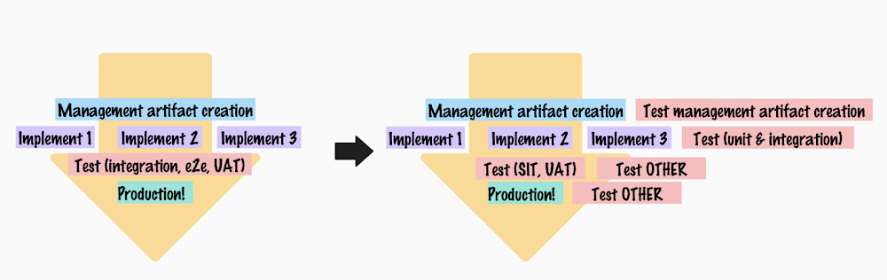

# Faking plans is easier than fighting plans

*Published 2026-06-24, updated 2026-07-29*  
*Source: <https://visible-quality.blogspot.com/2026/06/faking-plans-is-easier-than-fighting.html>*

---

Ever entered a project as tester early on into a project? At that time when you still hold the illusion that plans are about to be set and you are on time? And then, only to find out that the only early enough is in the time the project manager gets trained on their ideas.

Well, it's a pretty deflating experience, and unfortunately all too common. It appears there is no early enough without a lot of friction to include testing.

The source of friction is in the mental model. Having Plan - Implement - Test - Release is such a simple illustration. But when you actually overlay testing, it's the other side of everything, and if you wanted real tasks and control over it rather than long-running categories in which you report hours into, you would actually need a more finegrained breakdown of the testing tasks.

## Context for an inspiration

I worked on a fixed-price project, where the fixed-price was 50% of real price. These are typical in consulting world, and what they effectively mean is that the project environment is born passively hostile with a continuous fight on showing there is a change request lurking somewhere in the communication of two or more parties.

The fixed price estimation included no *test planning*, because why would anyone plan from testing perspective separate from project. And the whole plan of testing was described in usual abstract terms of *unit, integration, end to end -testing and UAT*.

I got to plan testing before the project plan, so I outlined the testing tasks:

- Identifying testing not promised within 8 hours effort allocation, when promise was *unit, integration, e2e, UAT* and what of it was *change to promised scope*.
- Deciding on quality practices: reviews, pipelines, timing of implement & test in mutually supportive ways
- Reviews of requirements spec, solution spec
- Testing while implementing, collaboratively, *unit and integration testing*
- Testing after implementing while integrated with a 3rd party system, minimalized, *e2e testing*
- Testing while integrated with a 3rd party system, necessary scope, but could be *e2e* or *UAT* and thus done from two different budgets
- Staying updated on learnings in the project

While planning for testing and reviewing the documents, I found a bug worth 25 000 € / annually, and facilitated a confirming conversation with the client, and patted myself on the back for **planning testing early on to avoid expensive problems down the road**.

If it only was that simple. Weeks later, I take a look at the project plan and none of the things I planned for testing got integrated. While appearance of a plan is not the plan underneath the surface, I find it both sad and funny that this is how we still insist on doing project planning. Not with a twist: they would not plan for things with people, or read the things from people, they would have AI in between all of that.

There is a special sense of middle finger that comes with "I did not bother reading the idea of key milestones you were communicating with an image, I rather sent your image to AI and here's a wall of text it had to say about it that made me completely miss the point, with a twist of false claims I have no capability of detecting".

I took my wins of finding the bug, and decided appearance of plan and the plan that will be executed can coexist, because faking it is easier than fighting it.

## Lessons from the inspiration

As always, doing the work teaches you a lot.

1. Changing other persons mental model was more possible at time before AI. AI allows for not making an effort in building own mental model.
2. Actual collaboration would win over co-creating and handing off artifacts. Two hours together on a plan wins two hours separately on the very same plan. That removes also the AI workslop in between that is worse than before.
3. Change management politics on fixed price projects remain an antipattern caused by competition tactics.
4. Feeling detached from appearance of plans is necessary for survival. You know, that sphere of influence, the cost of applying influence for change greatly outweighs the cost of faking it.
5. The things that matter like *access to version control tool to collaborate on in implementation* or *pipeline so that tests are not in head of someone* don't need to make it into plan to make it into action.
6. Use of AI splits us to two: developers and knowledge workers, and I find myself increasingly frustrated with the hurdles the latter crowd creates in the handoff.
