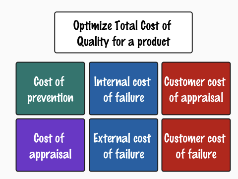

# How can our employees find information faster?

*Published 2026-07-28, updated 2026-07-29*  
*Source: <https://visible-quality.blogspot.com/2026/07/how-can-our-employees-find-information.html>*

---

For first day post-vacation, two things happened that inspired this post:   
1. I took a tool vendor course "OpenAI PartnerU Foundational Knowledge, July 2027"  
2. I spent over two hours trying to order a mobile phone for a colleague joining next week

This combination left me with a sense of insight worth blogging about, on *failure demand*.

In this age of AI (= everything is AI), one of the core questions I noted down for the course I took was the idea of moving from discussing AI to moving to discuss what we do and then considering right tools to enhance it. One of the questions they highlighed was:

> How can our employees find information faster?

I had just spent two hours on something that should have been five minutes. I wanted to select a specific phone from a short list of preapproved phones, and order one. But alas, things don't go as I want them to go. There had to be a bug.

The bug was a lovely combination of a new security feature in Chrome / Edge (shared engine for the architecture-aware) and the application handoff implementation between ordering systems of two different companies. The sense of powerlessness with a production bug was overwhelming. Multiple options of who could do something about it, hard to find routes to any and all of them, and a task I was on a schedule for but unable to process. A model example of cost of quality beyond appraisal (testing).

This idea of cost of quality, follows from the idea that quality if free. Someone could have tested and FIXED a bit more so that I would have to struggle a lot less.

I tested for workarounds quite a bit.

- I searched our internal boards for other people with the same kinds of problems to see if they had experienced it, only to discover a plethora of other problems in the same flows but not this
- I updated Chrome, in hopes of it being due to some internal state of not having updated my browser
- I tried restarting the browser, private browsing and more permissive browser settings, none of which helped
- I installed Edge on Mac in hopes of it working on Edge when it did not work on Chrome

And finally, I asked Edge Copilot. The Microsoft AI chat. Read the links about when a few security feature might have been introduced, and took the second option for workaround proposed: I used Firefox, and everything was fine again.

Going back to the question than directed my thinking:

> How can our employees find information faster?

I could have asked AI immediately instead of first struggling through the easy options. But really, I should not have been in need of this information. My goal should not be to find this information faster, but to *not need this information*. I had run into an example of failure demand.

Failure demand is this idea in quality, where lack of it creates work we then consider relevant. It has been one of the most powerful heuristics on my learning journey to realize that we want less, not more of testing. Accepting failure demand is a result of powerlessness in the system. And we need to see the system, not just the work we can contribute.

I leave you with this. Always be asking not just how we can do a thing, but what causes the need of doing that thing. Maybe with the very same investment amount elsewhere (let the devs test more!) our organizations delivery systems are better off.

And this bug - not an easy fix. All I did was adding to the body of knowledge in the internal boards with whoever comes after me.
