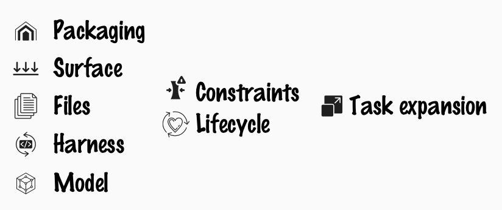

# Comparing Blue, Yellow, Red, Pink and Purple - How are they Different

*Published 2026-07-30*  
*Source: <https://visible-quality.blogspot.com/2026/07/comparing-blue-yellow-red-pink-and.html>*

---

As a tester, I have grown a practiced skill of classification. There are a lot of emergent criteria to classify, and with practice, I have added slices of perspectives that allow me to see things. Seeing what is said, I look for things that aren't said. And looking at testing tools, I look for options and differences.

And right now, AI for testing tools are overwhelming in options. With AI, everyone has a tool and discovery of value is harder than ever. I wanted to take a pick at calling out some of the patterns I might be seeing.

## The Marketing Layer

Imagine there is a small tech company somewhere far away, and you are a business minded person setting up a product company some 30 years ago. You make a deal of taking their promising tech, and you add a facade layer, product name, a slidedeck and your access to people they didn't have access to. You take Blue (with a contract), you call it Yellow. Over the years you add things to Yellow, and eventually you remove Blue from your Yellow. A valid way of building a product business.

Imagine there are open source tools, and you are a technically savvy person who sees value on grouping them some 30 years ago. Each small piece is available with a license that allows for redistributing with constraints, but they aren't thematically packaged together. You take Red and Pink, and you call it Purple. Over the years, the thematic packing grows stronger in value, you add things that fits to Purple. Purple becames known, and majority of people don't even know there are Red and Pink inside.

Adding that marketing layer is today easier than it was some 30 years ago. And since it is easier, it's done in scale making understanding all the Yellows and Purples and Rainbows hard. Creating products with AI support changed the game.

## Control over Long Term Value

Imagine a Finnish public sector company posting out a RFP for products in Accessibility Auditing and Monitoring. And ending up with both Blue and Yellow on their list. If Blue decides they can no longer build and maintain due to lack of financial resources, there is no Yellow. Paying for Yellow when the value is generated into both Yellow and Blue by Blue means you may end up eventially with a facade. Liking the facade of Yellow but needing the value of Blue is a real choice when making the purchase decision.

Architecture-awareness is not optional. For the Purples of the world, in worst case scenario, open source allows for Purple to maintain Pink2, when Pink actually is no longer around. For Yellows of the world, closed source is protected by win-win financial incentives.

If you are used to connecting things in world of accessibility Deque aXe is the Blue. There are a lot of tools that add little the what they make available as open source.

## Architecture-aware

We look at a testing tool, and they have all these features. And they all have AI in them, a lot with the promise that *you can use your already approved models*\* meaning the cost of what really is AI is outside the box they are selling. Their product does nothing without buying the other product. So how do we choose when comparing them all is not feasible, and architecture-awareness is needed for any comparisons of relevance beyond "I like this person and want to give them my attention, maybe even some of money".

Repeating this over and over again in being presented tools, I build and grow a classification frame, that allows me to get tool folks to tell me less marketing speak:

> What we've built, I'd kept selling the "unique layer" angle, you'd have been right to call it blue-with-files-on-the-side.

Let's briefly touch these perspectives of classification for AI in testing -conversations.

First, I look for where the value add they invest in is:

- Packaging is when they have facade level value and tell their story uniquely
- Surface is when they provide value by having their own user interface they expect you to interact in
- Files is when they drop you things that make AI better for specific slice of work
- Harness is when you have a loop (agent) and some of their own built-in instructions akin to files to drop
- Model is the engine that does the work.

Second, I look at the time perspective of value:

- Constraints are the things that must be true (ideas about data most prominently) for any of the value to be available
- Lifecycle is the idea of what stays around when you no longer pay them money

A lot of the tools are like gym membership. Going to gym is required. And if you no longer pay, anything you built on is no longer available.

Third, I look for their idea of testing

- Task expansion is the idea that in age of AI, I don't want testing that reports bugs. I want testing that fixes the bugs. I don't want dedicated testers providing the service, I want to level up everyone in the teams.

## My Yellow, my Choices

I would be hypocritical not calling out that I got my Yellow too. My Yellow is called, for now, CGI Test Intelligence Mesh, and it's files we drop in a particularly consumable way with a change of license mechanism.

If prompt engineering is an individual skill of how to talk to AI, context engineering is how your team and project talks to AI. And in my case, how your team brings in external influences impactfully.

The choices I make come from the belief that we need to distribute the control over long term value.
