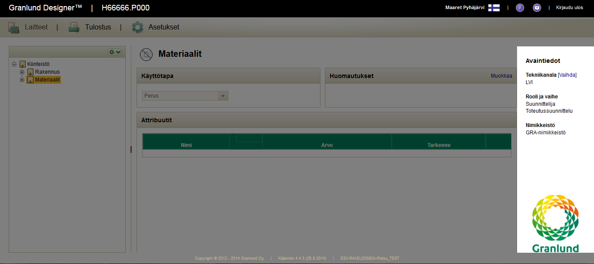

# Tester as a quality coach: enabler that leads with example

*Published 2014-09-26, updated 2014-09-27*  
*Source: <https://visible-quality.blogspot.com/2014/09/tester-as-quality-coach-enabler-that.html>*

---

I could not make it to Test Assembly 2014 yesterday but luckily there's twitter and all the ideas people share. And as usual, one thing in particular stuck with me: it's very clear the tester role is under heavy discussion whenever Agile gets mentioned in the theme.  
  
There were mentions of programmers being the only ones who provide value, and that message seems to come out strong again today with Reaktor Dev Day ongoing. While it is ridiculous to see "agile" organizations with as many managers as developers+testers (hands-on people), the discussions of elevating developers above the rest of us working hard on a common goal still seems unfair. Writing the code is important. But the most expensive mistake is to write the wrong code and working on that doesn't need writing of the code - we can share the work amongst a group without being in silos with mutual respect.   
  
There seems to be two directions offered to people with my aspirations in agile. I could spend time learning to program better and furthermore, I could learn to like it. There's a lot of job ads out there for a test developer but finding one that can actually deliver the results isn't that easy. Or I could see myself as a quality coach.   
> [@larelekman](https://twitter.com/larelekman) has a nice checklist at [#TAhelsinki](https://twitter.com/hashtag/TAhelsinki?src=hash) : [pic.twitter.com/KXoN0qyr60](http://t.co/KXoN0qyr60)  
> — James Coplien (@jcoplien) [September 25, 2014](https://twitter.com/jcoplien/status/515094669873930240)

The checklist presented seems useful reminder of helpful and enabling attitudes for a tester working in close collaboration with the team.  
  
In my team, I work hard not to be the gatekeeper even though I'm the only testing specialist. Developers take their own testing seriously. But still the amount and style of bugs sometimes leaves me wondering if they really even touched the product after the change.   
  

  
When we've coached developers to really take full responsibility of the
user experience and taught them the skills to deliver on that promise,
we might not need testers separately. There's more than running the software though. There's the questioning mindset as well that doesn't just apply on the software but also on the business decisions, user needs and designs we have on satisfying those.  
  
It's a bright spot in the automation centric agile world to see someone talk about the other route: being an enabler that leads with example.  
  
\*\*That bug on the picture: one extra dot in the code. I keep being amazed how small things appear big and the other way around.
