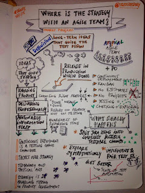
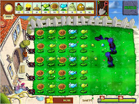

# Games are practice for life - what I learned on Test Strategy from PvsZ

*Published 2015-07-29, updated 2016-08-02 · Labels: Exploratory Testing*  
*Source: <https://visible-quality.blogspot.com/2015/07/games-are-practice-for-life-what-i.html>*

---

This spring, I was invited to DEWT on Test Strategy. For my experience report, I took a look at how I test at work and sought for "the ideas that guide test design".  
  
The analysis was troubling, as I felt there was no strategy to speak of. There's general ideas of what is acceptable for our product and what we target for the ways of working as a team. But with agile and continuous delivery, features flow through on a steady pace, each requiring different kind of thinking but starting from seemingly similar ideas of what information is useful at first, what keeps me up and awake while testing and what features are connected.  
  
[Zeger van Hese](http://twitter.com/testsidestory) listened in on my experience, and created a nice summary of it.    

  
I felt testing I was doing had transformed into selection of tactics, and that the most relevant part of the tactics selection was to choose enough over choose the right order. The idea was left to sizzle.  
  
One day, my son was playing plants vs. zombies, and a friend of mine was teaching him how to play. They practiced the same scene over and over again, trying out different strategies. They would limit the plants they could use to three, and try out different order of placing them in. They would discuss that the strategy of placing the sunflower plants (that generate sun used as currency) early on gives you compound interest, and makes it easier to play the game later. The sunflowers aren't so cool, so my son had a tendency of rather getting the cool stuff first, at the sight of first zombie.  
  

Listening in to the discussion, I realized there are different types of moves in testing. Some bring you compound interest, just like the sunflowers in the game when used early on. The tactics that build your relationship with developers pay back with the tedious finalizing of a feature. The tactics that enable us to release in special cases before it's all done-done because of a customer schedule promise. We need to complete the fight with all the different tactics, but the order in which we choose to take things in requires strategic thinking.

There's more differences to specific features I'm testing than I had given credit for. Each scene to play is different, even in the same product.

You may learn surprising things from games. Like a wise friend said: games are practice for life. We should pay attention to our lessons.
