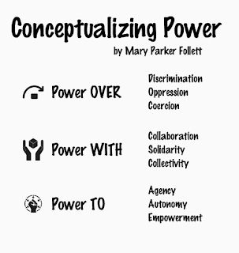
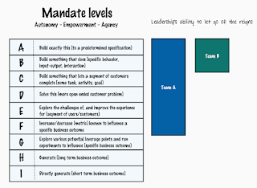
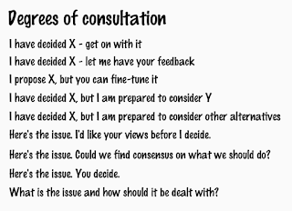

# Accepting and constraining leadership

*Published 2025-07-30*  
*Source: <https://visible-quality.blogspot.com/2025/07/accepting-and-constraining-leadership.html>*

---

As I leave my summer vacation 2025 behind, I have learned a bit about leadership and decision making. Particularly, I have learned that that in my role as service director responsible for testing services and applying AI in application testing, I have also hit a threshold on my capability of making decisions.

That means that the entire summer vacation, was an exercise of distributed decision-making in the family, and requiring my teenage children to take their fair share of deciding what is it that we are having for lunch today.

For someone who spent decades fighting against the idea of being called "leader" with an identity of always rather being the first follower for ideas worth amplifying, the amount of decisions required has been overwhelming. Overwhelming enough so that I no longer want to be deciding what to eat, when and where to meet but more like hating the fact that so few people step up to doing their share.

Reading some of the things people write about management roles isn't exactly helping. The ideas of assigning power over people with a blank slate bother me. So I looked around for models that could help me make sense of it all. And I wanted to share three favorites.

First model is about splitting power, as a reminder of having always that power to self-organize - expectation of agency, autonomy and empowerment. Kind of foundation to my ideas of why I did not want to go to leadership, I was comfortable on decisions that would impacted my results - immediate and growth. With the new role, I apply more power with -kind of approaches and classify the minimal scope of things where I have to apply power over anything or anyone.

What helped me make sense on team level, was mandate levels model by John Cutler. Recognizing how assignments arrive and are framed, and clarifying the framing has been invaluable.

And finally, the third one is more oriented to how I communicate on decisions, since the framing I have is clearly less than obvious to others. I need more words to explain where I am coming from.   
  

For the decisions of lunch, we did "What is the issue and how should it be dealt with?". Out of all the degrees of consultation, it was the only one that helped with my sense of overwhelm.

So I have a new frame for the leadership I exercise: I continue to reject power over, and lead towards power with and power to. It may be more work, but it is work that fits my ideas of how the world should be.
