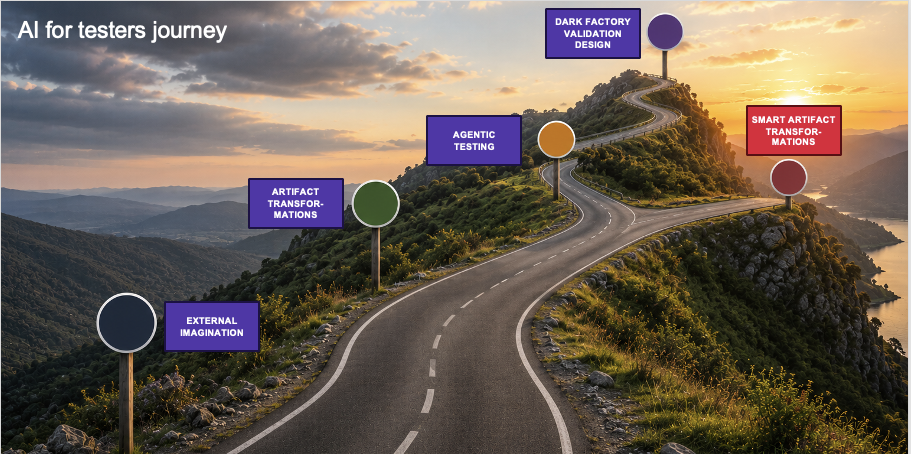

# Lessons Learned from AI for Testers Coaching

*Published 2026-05-13, updated 2026-07-29*  
*Source: <https://visible-quality.blogspot.com/2026/05/lessons-learned-from-ai-for-testers.html>*

---

When I try to teach, I find myself learning a lot. Sometimes I feel like I learn more by teaching than what people I try to teach learn from me. Other times, the balance is fine. Today I taught a small group of tester where the balance was not fine, and I have been thinking about it since.

What I came to realize in hindsight is that the group of today, while small, was also particularly versatile in two relevant dimensions:

- Their client project had limitations to using AI that made testing with AI particularly challenging
- Their background as system expert meant that the ideas of where I wanted them to be on their AI in testing journey caught me by surprise.

The client project limitations lead me to identify that there are six essential dimensions in which we need to discuss our allowances of AI:

1. What AI features are allowed? After choosing a tool like Github Copilot, clients still block many features: models by origin or purpose, CLI-use (unsupervised commands with shell access), and MCPs to name the most popular ones. These may not completely stop you from agentic testing, but they require you to be architecture-aware.
2. What data can be in the system tested? If the system tested has production-like data too close to production, the data is probably something to be excluded. Should you give access to playwright CLI or MCP to look at the application, it sees the data. Eyes on the the UI may be blocked for data.
3. Can the system be seen by AI? While early access competition reasons keep features secret, some platforms have license agreements that explicitly forbid using AI other than the platform built-in. This agreement based blocking is becoming more widespread, it seems, with notable examples being Guidewire and Salesforce.
4. Where to keep credentials and PII data? Well, learning to keep secrets separate is about time, but the practice is different. In addition to not including these in repos and ensuring that with commit hooks, you can't keep your own local secrets where AI has access. Or you might have an acceptable risk policy with credential rotation.
5. Code, including test code as a secret? Not all code is secret. A lot of code is in fact public. And we have cases where test code is used to make AI reverse engineer and implement entire complete libraries.
6. Examples, requirements, and other documentation could be secret? Not all but some of it. Knowing what is and isn't can sometimes pose a challenge.

The other lesson today was on the journey. What I was teaching with Github Copilot and agents was too much of a step today. It was too much because I did not split it to smaller steps like I did because I was not thinking about it just before the session. But it was also a lot because the starting point of expecting *visual studio code* and *playwright* from a test case based manual tester is a lot. Sprinkle in random bits of version control without a previous sighting, and a VPN that blocks your tool access, overwhelm is guaranteed.

The picture I drew was to illustrate the idea that I tried placing people on the crossroads of the journey towards building validate steps for dark factories. And they had barely made it to realize what the uses of AI as external imagination or opportunities or limitations of generating artifacts would be. And they might just as well be better off on the route to better creation of artifacts.
