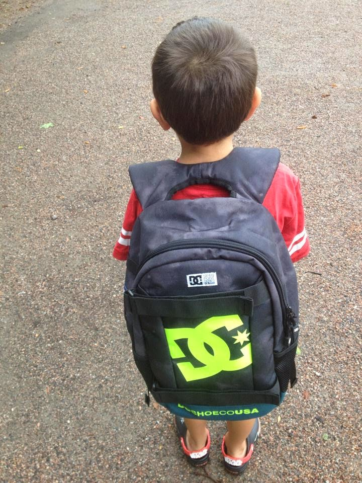

# Kids Creating with Computers vs. Coding

*Published 2014-08-13, updated 2014-08-14*  
*Source: <https://visible-quality.blogspot.com/2014/08/kids-creating-with-computers-vs-coding.html>*

---

My son, soon turning 7 years, started on 1st grade in school. It's been a great excuse for me to think about things I haven't thought about so much, both past and future - and my actions.  
  
**PAST**  
  
Starting from the past, I've looked into how I ended up becoming a software professional with a more specific label of identity: 'tester'. I remember a few core turning points in my childhood.  
  
Chronologically, first one is remembering that our family had a computer (Vic20, Commodore64, Amiga ...) that I absolutely loved. However, it wasn't discussed as family computer, it belonged to my *younger* brother. Not necessarily because he was more interested, but because he was a boy. I remember asking permission to use it, finding slots of time when it was available, always being the second one to gain access to the computers. The chances of learning stuff on the computer were limited at an early age.  
  
Either my parents were trying to be fair with the access on the computer or my brother was able to share, but I remember having my time on the computer. I learned English on Sierra's games at an early age - I absolutely loved comping up the right words to progress. I bought MikroBitti-magazines with printouts of programs I carefully typed into the program for the Commodore64 and I remember being extremely frustrated with a bug that prevented me from running the software I had "created" - copied really. My early experiences were successes with understanding how (and why) software doesn't work.  
  
I have forgotten about my courses on computers in school, but I remember my first programming course. We could do whatever we wanted, and me and my friend paired up to create a Pascal program that implemented some girly magazine questionnaire "Test if you are popular". I was really proud on the splash screen silly graphics but remember how silly structures I created for the conditionals needed for counting the points in the actual questionnaire.  
  
I was never told I couldn't do something. Then again, I wasn't pushed to do stuff with computers either. And the more I liked computers, the more weird I was. I had my friends - large group of them, I was never lonely - but I was never popular either. My reference group allowed me to like math, physics, chemistry and eventually, computers.   
  
**FUTURE**  
  
Now that I have kids, I want them to have a chance of learning to create, not just consume, on computers. They've played games at an earlier age and learned to click dialogs to progress without knowing what the text says. Quite different from me working with the English dictionary to play through King's Quest. I see that they are, at a young age, turning into more of consumers of technology than I ever was. Introducing creating is something I need to help with.  
  
Also, my daughter makes me suspect that with the social nature she has, she will not be interested in creating alone. And what still often happens is that when we teach code and computers, we teach it as individual skill. With her friends telling soon enough that something is not cool or girly enough, she is sure to go with the crowd. Thus the future needs changing the crowd.   
  
The future in Finland seems to have Koodi2014-project - first graders starting in two years will get taught programming. Both my kids will be out of the first grade system before that.  Reading the materials created to support the project also upset me with the code-centric attitude. While I think it's great to give kids the chances of experiencing that they can create stuff by coding, I'd also want them to get chances of creating stuff for computers by not coding. The software professionals today and in the future don't all code or don't code all the time. Reading the guidebook for teachers, I get the sense that we're starting to teach not valuing the non-coders contribution: the salespeople, the product managers, the business analysts and domain experts, the graphic designers, and my kind, the testers. I already have to listen to programmers creating unworking software (well, works on THEIR machine in THEIR use case) being better than others because they code, I would rather have the future teach kids collaboration and value of different skills in creating working software.   
  
MY ACTIONS  
  
I decided on my personal actions already in spring. I contacted my son's school's headmaster to suggest that instead of waiting until 5th grade for computer club to start, I volunteer to run one for 1st graders (and 2nd graders next year so that both of my kids get to be in). They welcome the idea, without knowing much of the contents.  
  
I want to focus on creating with computers, in collaboration. I want us to do artwork together, add audio and put things together in very lightweight programming activities. Perhaps create ideas that are not given as "create this by programming" but creating something they could come up with. We'll do some code.org exercises and some testing exercises, also probably a bit of agile practice exercises. I'm sure different participants contribute different aspects with the idea that creating software is social group work where we can build on the others skills and ideas.   
  
So, no "code school" for me. Code shouldn't be placed as the hub of it all. If we are "missing 17000 professionals by 2016" from software, not sharing the work with different people with different interests (other than code) is not going to help us.  I want software skills to be taught more inclusively. Code is included. But a lot of other interests that people may have should be included too.
