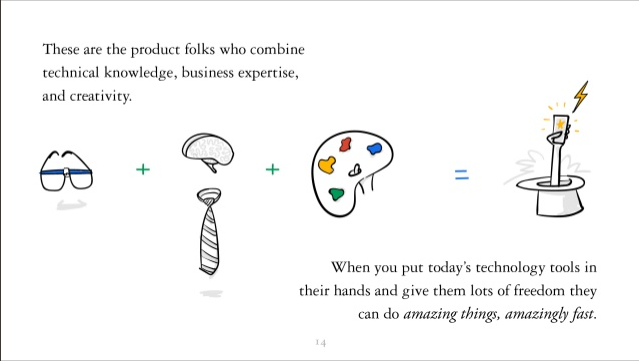
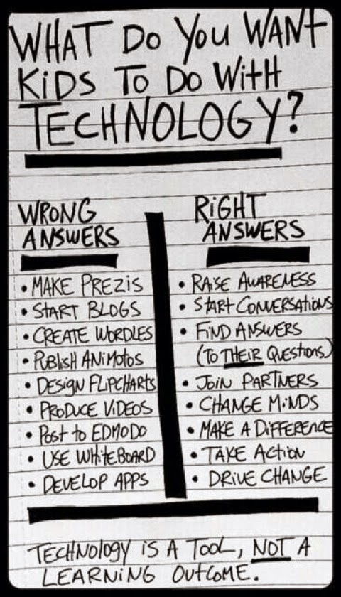

# Participating Hour of Code - a one person view

*Published 2014-10-29*  
*Source: <https://visible-quality.blogspot.com/2014/10/participating-hour-of-code-one-person.html>*

---

I've been thinking and preparing for quite some time, but some weeks back I got together the final details to take action. I went to [http://code.org](http://code.org/) to be reminded that Hour of Code week is December 8.-14 which also serves as a nice start for the Smart Creatives Club I've been volunteering to run with my son's school as soon as we get all practicalities sorted.  
  
Smart Creatives was a term I picked up from [a presentation by Eric Schmidt](c:\Users\mpy\Desktop\2014-10-29%2010_06_39-Eric%20Schmidt_%20How%20Google%20works.png) at time I was trying hard to explain why I dislike the concept of "code school" that misses out a core of what makes me love work in technology.  The following picture is from the presentation.  
  

  
  
  
  
Instead of growing programmers of the likes I meet mostly, I'd like to see my kids grow up knowing technology and programming, but putting that together with understanding of purpose (business) and creativity, and choose a corner / combination they will love the most. I really love testing, and find that out of these three, my focus is more on creativity and business expertise, but technical knowledge is there as well.  
  
I've also grown really fond of this list that went around in twitter a while back. I don't want to teach kids to write code, I want them to learn ways of collaborating to create solutions they would find useful. I want to emphasize collaboration.    
  

  
Emphasizing collaboration makes Agile Finland ry a perfect home for the things I'm setting up. I'm really happy to be able to announce that my favorite non-profit is there for participating the code.org code week by having an open free Hour of Code for 30 kids on December 8th 18.00 - 19.30 at Leppävaara Library. And that Agile Finland is equally supportive of the private Hour of Codes I will do with two groups at kindergarten Viskuri (5-yo & pre-schooler groups) and group of 1st graders in Malmin peruskoulu. The one at Malmin peruskoulu will then continue as a monthly club, not about programming per se, but about creating together, in collaboration. So far I've decided we're going to be working on multi-media book created fully by the kids for the spring 2015, meeting once a month.  
  
Last week I had the pleasure of meeting a 15-year old girl, who as far as I understood, did not consider computers as something she would be particularly interested in. Spending a week testing with us and being actually very very useful with the courage to speak out, I hear she is saying that testing might be fun. I've agreed to hire her for some of the work I would need done for my side business, and will invite her to join me to co-teach (being paid) the Hour of Code. She might not end up with the love of technology and testing I have, but I think this might also be infectious. Pushing code first isn't the way to keep me engaged, perhaps that could be true for others, like her, as well.  She's super smart, and it would be a loss if she missed out on the best job there is in the world - creating with computers.   
  
I've just published a call for action for others to join for the Hour of Code in Finland, I would be happy to help out locally. There's a huge need for volunteers to show the ropes to the young ones, and I'd love to see us agree that code is just one tool yet a very powerful one.
