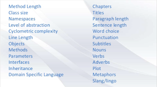

# Reading code, reading natural language

*Published 2015-07-25, updated 2018-12-26*  
*Source: <https://visible-quality.blogspot.com/2015/07/reading-code-reading-natural-language.html>*

---

I enjoy reading and writing. I write this blog. I write articles. I write lighter private texts. And I read what others write as much as I can.  
  
Growing up, I hated writing, loved reading. I remember leaving a note in every written piece in school to not read the stuff the the class, as sharing my thoughts was an unpleasant idea. I had teachers who would tell me they'd lower my grade for that. But I would also learn to write well enough but always just below the limit of being sampled for other students. Since then, things have changed.  
  
Many of us that have ended up with software development, have to have some sort of an interest / ability towards reading and writing. There rarely was a teacher explaining and guiding us through every concept. We needed to learn to get stuff from books and papers, google. And recognise what it worth our time and what is not.  
  
I have a special love for helping developers create clean code. I've come to that from caring for how the individuals I work with feel about their work, and observing that developer happiness as well as random regressions in software seem connected with quality of the code as developers perceive it. If developers are afraid or hesitant to touch something, when they do, it breaks more. If developers dislike a piece of code, the overall end user experience on that area won't improve. And with focus on clean code, I'm successfully working with a team without relevant test automation still safely releasing to production with continuous delivery.  
  
While there's many technical topics that I listen to but feel disconnected with, readability and maintainability of code are things I love learning more on.  
  
Less than a year ago, I learned to compare the amount of code we have to a pile of Harry Potter books. It made scope of our work so much more tangible - this is what we read through, piece by piece over and over again. I could easily see in my head how different the style of reading the actual books is to reading the code, and got interested in better use of tools to help with the different readings style for code.  
  
Yesterday, for the purposes of organising [a testing conference](http://europeantestingconference.eu/) for developer and tester testing perspectives, I got to listen in to a discussion between two brilliant developers on a topic that really hit my interests: code readability.  
  
The discussion readability was on the fact that it's very hard to say what is a good block of code. There's no absolutes on that. But there's a parallel to writing natural language. What is a good paragraph? With examples over the years, seeing good and bad, we've learned the idea of that. And the very same idea guides us when looking into code.  
  

  
Over the years, we've all learned some ideas on what is good in writing natural language like English.   Both actively and passively, we're recognising what makes reading something easy and good. We recognise patterns of good and bad. Could it be that there's more parallels in our skills in recognising goodness in natural language and code?  
  
Thanks for the inspiration to [Kevlin Henney](https://twitter.com/KevlinHenney).
