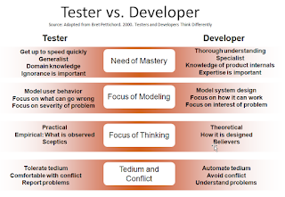

# Fear of technical and unknown

*Published 2016-03-14, updated 2016-08-02 · Labels: Exploratory Testing*  
*Source: <https://visible-quality.blogspot.com/2016/03/fear-of-technical-and-unknown.html>*

---

I've been a tester for 20 years, and it has been (and will continue to be) quite a learning journey. With this post, I wanted to take you back on my memory lane of something that really spoke volumes to me, enough that I remember to keep going back to it 15 years later: Bret Pettichord's old article on how testers and developers think differently.  
  

  
Here I wanted to address one of these four dimensions in particular: Need of Mastery. The reason I want to discuss it is that I delivered a half-day workshop on API testing last Thursday, and looking at how the group responded to the work lead me to recognize a common pattern in people facing exploratory testing in course settings: fear of the technical, fear of the unknown. Paralyzing fear.  
  
For longer than I care to remember, I've learned to tell myself that as a tester I'm expected to be able to work with partial information and understanding, and still be useful. While I definitely am not a product expert on day 1 of a new product, I take pride in being able to provide results and being useful already then. It's about the choices I make on what to focus on next. And day 1 is always just a beginning, it opens up the chance of treating every day as a learning experience I walk out of knowing just a tiny bit more than I did before the day.  
  
As a tester, I've learned to think that my job is to get up to speed quickly, and be brave about addressing stuff I don't know - to learn, to change what others know. Ignorance is important, it helps me work with the way a new user feels, but it is also temporary. I need to pay attention to to it before I lose it. And I need mechanisms to get closer to it again and again.  
  
When facing a new application to explore, I feel the tingle of fear of me not being good enough for that particular application or domain. I fear there's no feedback I could provide on top of what is already known and what people care for. But the fear isn't stopping me, it's driving me. It reminds me that when facing fear, I can do something, anything, to learn just a little more. If I choose to plan a lot but do a little, I know a little. There must be a balance that ties my considerations into the actual doing of testing. I know that if I don't start testing while clueless, the time is ticking away and I'm not providing anything. I'm not learning or contributing. And those two tend to go hand in hand.  
  
When faced with something we don't know, we can step away and say we need more info before we start. Or we can plunge in and accept that trial shows us something of what we know.  
  
I'm realizing there is a particular skillset to test code I don't yet understand. I can feel I need to know much more, but still make progress. There's a similar skillset for programmers on working with code they don't yet understand - techniques and approaches that make learning fast while already doing the work.  
  
Need to think of how I could explain the skillset better. If you have ideas, I'd love to talk. Ping me on skype: maaret\_pyhajarvi if you feel like contributing on this.
