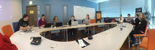

# From teaching kids programming to teaching adults

*Published 2016-03-24, updated 2018-12-26 · Labels: Mobbing*  
*Source: <https://visible-quality.blogspot.com/2016/03/from-teaching-kids-programming-to.html>*

---

Two weeks ago, I was sitting in a bus on my way home from Brighton TestBash, and something very typical happened. From a random discussion, I turned the idea into an actual event within a short timeframe. We decided a session to teach my colleagues, the "non-programming testers" programming was in order. The event just emerged. "It does not have to be a big deal" to learn programming as Anna Baik and Andrew Morton had just reminded us - or organizing events out of a whim.  
  
With open invitation to the community in Finland, we found 10 people within a very short timeframe to join us for a basics of programming session this evening.  
  

  
We worked on the next generation of "Teaching Kids Programming" -materials  - with the added stuff included since the project branched.  
  
The participants got to experience the basics of Java and Eclipse, with regular discussions on how this "simplified stuff" connects with real programming. The group learned loops with Sparrow Decks (code examples of knowing how many times things get run shown in fast progression without instruction) and learned to work together in pairs with Strong-Style Pairing. Everyone got through the instructed part, passed the quiz with lessons they had just learned from the teaching and topped it up with deepened learning through unit test Koans in a Mob Programming format.  
  
The biggest reward for me on organizing was a friend who said she'd join the session to see why I would make such a fuzz over *this experience of learning programming being different*. At the end of the event, she said she really enjoyed it, and could see what I love about this.  
  
The energy in the room was towards continuing to learn this way at work, asking people to let us learn through immersion as being the hands in a pair or joining a mob. We decided we should get together to continue on with another session, to dig deeper and practice.  
  
There's hope for all adults who want to learn this stuff. It's never too late. And there's many ways of learning, not having experienced this way might just be one of the things that make you energized on learning.  
  
There was a great reminder on twitter as I mentioned we're doing this session:  
> [@maaretp](https://twitter.com/maaretp) [@LlewellynFalco](https://twitter.com/LlewellynFalco) Annoys me how strong the "don't learn new skills, you'll never be any good at them!" meme is.
>
> — Anna Baik (@TesterAB) [March 24, 2016](https://twitter.com/TesterAB/status/712928809306165249)

Like we reminded the group: we all know how to read&write, but few of us have ended up as award winning novelists. Any level of programming skill is useful.  
  
My reminder of all of this is this:

> [@TesterAB](https://twitter.com/TesterAB) [@LlewellynFalco](https://twitter.com/LlewellynFalco) I don't get this. I get (and do myself) the one that gets annoyed with overvaluing \_this new skill\_ over others.
>
> — Maaret Pyhäjärvi (@maaretp) [March 24, 2016](https://twitter.com/maaretp/status/712929180678299648)

Given enough time, this skill is lovely to have in one's toolbox. And it's not away from valuing the skills I've learned in the 20 years leading up to this point.
