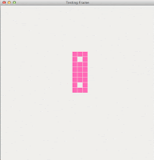

# Programming for practice

*Published 2016-07-11, updated 2018-12-26*  
*Source: <https://visible-quality.blogspot.com/2016/07/programming-for-practice.html>*

---

There's tons of little things listed out there to take up as practice problems when you're fine-tuning your programming skills. The things you find as programming katas are not really just problems to solve to completion, but the idea is to focus on deliberate practice.  
  
Some weeks back I did my fourth coding dojo, that keeps repeating the same problem: game of life. The idea of deliberate practice in that is on getting new pairs and various constraints to the same problem, and learn without trying to deliver anything. In coding dojos, the end result gets deleted at the end of the session. The deleting did not bother me, but the fact that I still never finished the problem, even outside the sessions did. So I ended up spending a late Sunday afternoon pairing with the main intent to not just get to a good start, but actually finish.  
  
Our final version was to choose one of the more complicated oscillator patterns to display on a little GUI.  The "finished" product has still a ton of features I know we should add - things for scrolling for spaceships and this fun idea of color coding age of cells into the animation among other things.  

  
But getting to this point on a deliberate practice session was relevant. Having done so many that are time boxed instead of focusing on the result, this was great.  
  
We did the implementation test-driven with approvals. With any deliberate practice thing, there's always the doing and the meta parts, and we had a great discussion on the meta after the doing. In particular, we talked about how the ApprovalTest style tests drove us and where the focus was.  
  
Our first test was on a cell having no neighbors and thus dying. The very first test already set us up for deciding how we'd want to represent our tests as before and after ascii art in approvals. Ascii art sounds weird and fancy, but it's the best way for me to describe this - the visual of the board in two stages.   
  
All the tests that drove the logic creation followed the same format, so I took an example from a later tests approved file of what this looks like.  

There was this one part of the doing, where we were looking at the need of having something other than an empty board on the second snapshot. As we were working with Approvals, there were two choices on how to set up the test: we could manually create the expected file before any code that creates it exists (what I thought we should do, red first) or we could just use the power of recognition to stop and think about the result we were creating and locking it down by accepting it when we saw it was good. With the latter, the idea of the test was held in our head, and a green test actually was driving us to turn it to red, to be again turned into green through acceptance.  
  
In code retreats, you never get to see other people's code, so we ended up [publishing our solution of yesterday to github](https://github.com/isidore/GameOfLifeKata).  
  
*(If you're puzzled on the text file, here's an attempt to explain that. With ApprovalTests, we serialize objects into file and can verify them in various file formats. To create the file, we're overriding the toString() to make the stuff returned on object more sensible, and to call a check on the objects we just say Approvals.Verify(object). Approvals are available on a number of languages, Go being most recent and I take joy in giving the framework some exploratory testing in various conference sessions showing how unit testing misses stuff.)*
