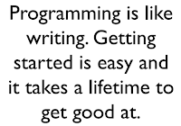

# The Binary of Coding in Testing

*Published 2016-12-22*  
*Source: <https://visible-quality.blogspot.com/2016/12/the-binary-of-coding-in-testing.html>*

---

I've just spent a week deep in code, and yet yesterday in a podcast bio, I introduced myself as a non-programming programmer. To start today, I'm reading a [blog post](http://www.ontestautomation.com/should-test-automation-be-left-to-developers/) framing "I am not a developer. I have a background in Computer Science, I know a
thing or two about writing code, but I am definitely not a developer."  
  
People care what they are called and I care to be called a tester and I've only recently tried fitting on the additional label of "programmer".  
  
Yesterday, I got called "my manual tester" by the Product Owner with an instant annoyance reaction to both words "my" (he owns the product's priorities, not me or my priorities in a self-organized team) and "manual" (exploring with focus on test automation and thinking smarter than those who just focus on regression test automation, is that manual?).  
  
There's this idea around with testers that there is somehow in coding "those who do it well". It hit a particularly sensitive spot seeing it yesterday after a week of reading and linting generally not the best code and thinking back to my experiences with mob programming that made me realize that there are not much of people who inherently all by themselves do it well. Some, over time, develop better habits and patterns, but even they have more to learn - and usually, the best of them realize learning is never done. There are not people who "do it well". There are people who "do it and learn to do it better". Other than the fact that there's a large group of people who don't do code at all, the rest of it is a continuum, not a binary in being good. Thinking of programming as something you either have of don't is not a good way to approach this. I rather frame it as a friend helped me frame it: everyone who has written Hello World is a programmer.  

I usually rather leave programming for people who enjoy it more than I do. That's why I'm a non-programming programmer. But there's aspects of code that I enjoy tremendously. Creating it together to solve problems. Reading it to figure out if there's better ways. Comparing it to expectations that can be codified (lint) and patterns of businesses and real-world concepts. Understanding what is there (and could work) and what isn't there (so can't work). Making it cleaner when it was already made run in the first place. Extending it within the limits of what I'm just slightly uncomfortable with. And that is already quite a lot.   
  
I loved how Anna Baik framed this.   
> [@maaretp](https://twitter.com/maaretp) Agreed. I also mistrust the amount of energy put into reinforcing the binary - why? Who does it benefit? I only see reduced choices
>
> — Anna Baik (@TesterAB) [December 21, 2016](https://twitter.com/TesterAB/status/811581555030298625)

I find that the binary thinking keeps people with potential out, and managers who would want to see more code in  testing overemphasizing code setting foolish targets that make good testers bad programmers. Getting rid of the binary, we would start talking about how the good testers could be good coders too, without giving up the good tester aspects they have.   
  
It's really about learning.  This morning, I complimented my daughter's Play-Doh creation as it had significantly improved from first version she showed last night. Her words back to me serve as great reminder of the thing I so would love to remember every day at work:  
> "All it takes is practice and I will keep practicing".
