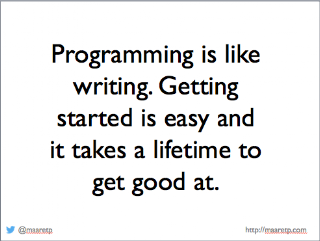

# Observations on Survivorship Bias in Programming

*Published 2017-11-18, updated 2018-12-26 · Labels: Programming*  
*Source: <https://visible-quality.blogspot.com/2017/11/observations-on-survivorship-bias-in.html>*

---

Programming is a fascinating field of study. For a long time, I was discounting my programmer abilities for never staying around one language long enough to get fluent with syntax, and if you need google to remember when others (supposingly) didn't, it must mean that I'm not a programmer.  
  
Mob programming changed that for me. I saw that others needed to google heavily too. Just like me, they remembered there were many sorting algorithms, but needed to check how a particular one would be implemented - they knew, just like me, the word to google for. And obviously, it's not like that is a problem we need to solve every day in the real life of a programmer, that's where libraries come in.  
  
There's still other things that come in as a little voice in my head, trying to talk down the programmer me.  

- I don't take joy in all the same types of programming work as others around me do
- I don't pay attention to all the cool libraries that are emerging and their inner workings for comparison purposes, still often happy to go with what I got
- I'm more interested in mender than maker types of programming

I realized that instead of listing the things I do, my voice inside my head lists the things I don't do. And as so many women before me, when I don't tick all the possible boxes, I don't apply. Instead of a job application, I do this on what I identify myself as - usually as a tester, not a programmer. Yet recently working with my inner voice, as (polyglot) programmer in addition to all the other things I am.

There's a thing referred to as *survivorship bias*. It is our unfounded belief that when we are successful, the things we did are what are needed for success. All of this, while there might not be as strong correlation as we like to tell ourselves.

So if a programmer does well mostly talking about technologies in particular way, both they and others around them attribute the visible interest in technologies as a reason they are a good programmer. A new line to a list of what we must be to qualify is born.

If a programmer does well not collaborating with others, just focusing on solo work to think deeply around the problem, both they and others around them attribute ability to work alone as a reason they are a good programmer. A new line to a list of what we must be to qualify is born.

There's many behaviors we see successful people do. Without mobbing, the control on what people choose us to see is on them. But each thing creates a new line to a list of what we must be to qualify.

Survivorship bias is strong in programming, and it results in lists that feel impossible to tick. And when the visible behaviors around you differ, it can be really easy to discount what you are.

We need to make it easier to be a programmer. It's not an end, it is a journey one can start. And there's many paths we can take. Be careful not to force the path you have chosen, be open to other options.

