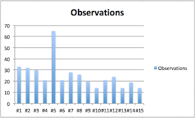

# A Python Koans Learning Experiment

*Published 2020-03-28*  
*Source: <https://visible-quality.blogspot.com/2020/03/a-python-koans-learning-experiment.html>*

---

I'm curious by nature. And when I say curious, I mean I have hard time sticking to doing what I was doing because I keep discovering other things.  
  
When I'm curious while I test, I call it exploratory testing. It leads me to discover information other people benefit from, and would be without if I didn't share my insights.  
  
When I'm curious while I learn a programming language, I find myself having trouble completing what I intended, and come off a learning activity with a thousand more things to learn. And having a good plan isn't half the work done, it is not having started the work.  
  
On my list of activities I want to complete on learning Python, I have had Python Koans. Today I want to complete that activity by reporting on its completion and what I learned with it.  
  
**Getting Set Up**  
  
The [Python Koans](https://github.com/Felienne/PythonKoans) I wanted to do were ones created by [Felienne Hermans](https://en.wikipedia.org/wiki/Felienne_Hermans). On this round of learning yet-another-programming-language (I survived many with passing grades at Helsinki University of Technology as Computer Science major), I knew what I wanted to do. I picked Koans as the learning mechanisms because:  

- Discovery learning: learning sticks in me much better when instead of handing me theory to read, I get examples illustrating something and I discover the topic myself
- Small steps: making steady progress through material over getting stuck on a concept - while Koans grow, they are usually more like a flashlight pointed at topics than requiring a significant  step between one and the other
- Test first: as failing test cases, they motivate a tester like myself to discover puzzles in a familiar context
- Great activity paired: social learning and learning through another person's eyes in addition to one's own is highly motivating.
- Exploratory programming: you do what you need to do, but you can do what else you learn you need to do. Experiment away from whatever you have to deeper understanding works for me.

This time I found a pair and mechanism that worked to get us through it. Searching for another learner with similar background (other languages, tester) on Twitter paired me up with [Mesut Durukal](https://twitter.com/DurukalMesut), and we worked pretty consistently an hour a day until we completed the whole thing in 15 hours.

The way we worked together was sharing screen and solving the Koans actively together. After completing each, we would explore around the concept with different values or extending with lessons we had learned earlier in Koans, testing if what we thought was true was true. And we wrote down our lessons after each Koan on a shared document.  
  
**The Learning**  
  
Being able to look back to doing this with the document as well as tweets two months after we completed the exercise is interesting.  I picked up some key insights from Twitter.  

> On Koans for Python comprehensions, this one really threw us off for a moment. Still loving discovery learning, 6 hours in with [@DurukalMesut](https://twitter.com/DurukalMesut?ref_src=twsrc%5Etfw). [pic.twitter.com/53Zbvcfqd0](https://t.co/53Zbvcfqd0)
>
> — Maaret Pyhäjärvi (@maaretp) [January 21, 2020](https://twitter.com/maaretp/status/1219702197233037314?ref_src=twsrc%5Etfw)

> Writing python I’m appreciating how human connection helps me recall. Working through Koans with [@DurukalMesut](https://twitter.com/DurukalMesut?ref_src=twsrc%5Etfw) gets connected with how I know remember how to do a particular thing.
>
> — Maaret Pyhäjärvi (@maaretp) [January 22, 2020](https://twitter.com/maaretp/status/1220030497247633408?ref_src=twsrc%5Etfw)

  

> While doing Python Koans, there has been numerous times when we are supposed to assert type of exception without knowing which exact type of exception would come out. When we see it, we know if it is right. Exploratory programming.— Maaret Pyhäjärvi (@maaretp) [January 30, 2020](https://twitter.com/maaretp/status/1222950437403361280?ref_src=twsrc%5Etfw)

> Looks like completing [#Python](https://twitter.com/hashtag/Python?src=hash&ref_src=twsrc%5Etfw) Koans with a pair is a 14-15 hours of effort. It has been a lot of fun! <https://t.co/1Z1N42RKZ6>
>
> — Maaret Pyhäjärvi (@maaretp) [January 31, 2020](https://twitter.com/maaretp/status/1223265847482949633?ref_src=twsrc%5Etfw)

Looking at out private document, the numbers are fascinating: 382 observations of learning something.  

  
With 15 hours, that gives us an average of 25 things in an hour.  
  
On top of those 15 hours, I had a colleague wanting to discuss our learning activity, and multiple whiteboarding sessions to discuss differences of languages the learning activity inspired.  
  
Next up, I have so many options for learning activities. Better not make promises, because no matter how publicly I promise, the only thing keeping me accountable is activities that we complete together. Thanks for the super-fun learning with you, Mesut!
