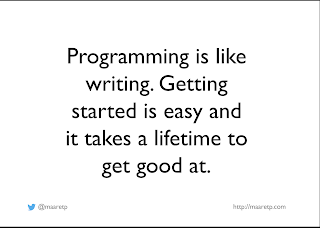

# Testers Need to Read Code

*Published 2021-05-16*  
*Source: <https://visible-quality.blogspot.com/2021/05/testers-need-to-read-code.html>*

---

Moving from organization to organization, and team to team, I find that there is always a communication gap between testers and developers. The gap does not mean lack of respect, or not getting along. It means that there is information one party holds the other could use but don't get.

Year after year, I have watched organizations advice \*developers\* to write guidance to testers into Jira tickets, to link documentation and provide demos as part of the tiny handoffs. I watched the community of testers advice \*testers\* to ask for that documentation and those demos, and ask questions.

Yet, I find myself looking at a gaping hole in a lot of teams and organizations around the ideas of the role of \*code\* in these handoffs.

Cutting through the chase: **I believe all testers need to start to read code**.

And when I say all testers, I don't say this lightly. I have worked extensively with business testers doing acceptance testing from the point of view of domain expertise. I have worked extensively with career testers working side by side with developers. I have worked extensively with testers specializing in creation of test systems. And I've heard this from them all: time is limited, and we need to make choices where we spend our time.

First, let's talk about code: reading and writing of it.

Learning Programming Through Osmosis -talk, 2016

We keep forgetting that none of the programmers we have in teams know everything of programming. They usually know enough to make progress through googling things they need to complete task at hand. And they know more tomorrow than they did today - every task we complete grows us a little more.

Thus when I call for \*all testers\* to \*read code\*, I don't assume fluency from day 1. I don't assume we all see the same things. But starting on that journey of reading creates skills we need in doing the tester work better.

Think of it as if you were peeling layers:

- Start with CHANGE in mind - change matters for prioritizing the testing you do

- Read commit messages and pay attention to the component that was changed.
- Read contents for size to start building your own idea of relationship of size, content and impact to testing
- Read names of the things that change, instead of the details that change, to target your testing to concepts
- Ask some questions about what you see is changing
- Combine this new source of information with your hands on experience testing the versions with the changes and build a model that supports your prioritization

- Deepen with IMPORTANCE in mind - know which parts of implementation matter

- Read folder structures to understand the models built in code
- Read to notice frequent change over stable function
- Read to notice many contributors over one

Reading code does not mean reviewing code. You may eventually want to review code and leave your "approved" or "needs work" notes, but it is by no means a starting requirement.

The starting requirements is that instead of trusting secondary agreed sources for the information about what you have at hand for testing, using code as a source of information is essential. Mostly things don't change without the code changing \*somewhere in the ecosystem\*, and seeing the change helps you target testing.

It is not sufficient to test by discovering all the promises the software fulfills and mechanically going through them again and again, inspired by what the jira ticket requests as a change. Reading code gives you an added layer.

It's a three layer prioritization problem:

- understand width of what it does for all types of stakeholders
- understand the business to narrow it down to important
- understand the tech to localize the search

Like with learning to read and write, we start with reading first. Some of us never learn to write that best-selling book.

What I ask for is not a big thing, you could try 15 minutes a day - starting with asking where to go to find this information.
