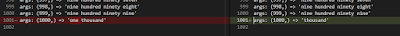

# TDD makes a bad programming test for testers

*Published 2021-12-10*  
*Source: <https://visible-quality.blogspot.com/2021/12/tdd-makes-bad-programming-test-for.html>*

---

I'm a tester by trade and heart, meaning that looking at a piece of code, I get my thrills on thinking how it will fail over how can I get it to work. Pairing with a developer who don't understand the difference can be an uncomfortable experience. Seeking weaknesses in something that exists is a bit of a different exercise than building up something.

Imagine an interview situation, going in with "Set up your IDE on language of choice ready to go". A tester pairing with a developer on a "programming skills tests". That setup alone is making me uncomfortable.

With an exercise out of the blue, the usual happens. The expectations in what we're about to do get muddled. They share a gist of numbers written in English as text. Working on code they start with asking for "signature" over explaining the problem. The usual troubles with pairing with someone new.

With an empty canvas, we write the first test selecting something from that list in gist.

def test\_1\_becomes\_one():

assert int\_to\_english(1) == "one"

Following red, the test won't pass without implementation. So you add implementation.

def int\_to\_english(n):

return "one"

Expectations are about to get more muddled. While I know where this is going with TDD, this is not the thing I signed up for.

I know that I can build up the implementation from here. And that it shows how I would solve this puzzle. But my work starts from seeing one of the many ways the puzzle is solved, and I try to steer towards it (with little success, of course).

I ask to just say the problem in English. Knowing the IDE runs co-pilot, I am hoping to steer the conversation from designing code with TDD to testing code someone designed - critiquing the design that emerged, figuring out what values reveal information that we missed something, seeking limits of the solution.

The English comes off as 

#function to convert integer to text

It's not particularly good English of the problem, and if I knew what the pair holds in their head, I could have improved the English to 

#function to convert integer to English for values from 0 to 999

Copilot is super-helpful giving multiple solutions to choose from, with ctrl+enter. Now we're talking testing!

The first option is next to hilarious.

def int\_to\_english(n):

if n == 0:

return "zero"

elif n == 1:

return "one"

elif n == 2:

return "two"

elif n == 3:

return "three"

elif n == 4:

return "four"

elif n == 5:

return "five"

elif n == 6:

return "six"

elif n == 7:

return "seven"

elif n == 8:

return "eight"

elif n == 9:

return "nine"

elif n == 10:

return "ten"

elif n == 11:

return "eleven"

elif n == 12:

return "twelve"

elif n == 13:

return "thirteen"

elif n == 14:

return "fourteen"

elif n == 15:

return "fifteen"

elif n == 16:

return "sixteen"

elif n == 17:

return "seventeen"

elif n == 18:

return "eighteen"

elif n == 19:

return "nineteen"

elif n == 20:

return "twenty"

elif n == 30:

return "thirty"

elif n == 40:

return "forty"

elif n == 50:

return "fifty"

elif n == 60:

return "sixty"

elif n == 70:

return "seventy"

elif n == 80:

return "eighty"

elif n == 90:

return "ninety"

elif n == 100:

return "one hundred"

elif n == 200:

return "two hundred"

elif n == 300:

return "three hundred"

elif n == 400:

return "four hundred"

elif n == 500:

return "five hundred"

elif n == 600:

return "six hundred"

You don't need to test beyond a glimpse of a review that this is not going to work out. Browsing further, you see more promising options.

def int\_to\_english(n):

#dictionary to store the values of each digit

num\_dict = {

0: 'zero',

1: 'one',

2: 'two',

3: 'three',

4: 'four',

5: 'five',

6: 'six',

7: 'seven',

8: 'eight',

9: 'nine',

10: 'ten',

11: 'eleven',

12: 'twelve',

13: 'thirteen',

14: 'fourteen',

15: 'fifteen',

16: 'sixteen',

17: 'seventeen',

18: 'eighteen',

19: 'nineteen',

20: 'twenty',

30: 'thirty',

40: 'forty',

50: 'fifty',

60: 'sixty',

70: 'seventy',

80: 'eighty',

90: 'ninety',

100: 'hundred',

1000: 'thousand'

}

#if the number is less than 20

if n < 20:

return num\_dict[n]

#if the number is less than 100

elif n < 100:

#if the number is a multiple of 10

if n % 10 == 0:

return num\_dict[n]

#if the number is not a multiple of 10

else:

return num\_dict[n // 10 \* 10] + ' ' + num\_dict[n % 10]

#if the number is less than 1000

elif n < 1000:

#if the number is a multiple of 100

if n % 100 == 0:

return num\_dict[n // 100] + ' ' + num\_dict[100]

#if the number is not a multiple of 100

else:

return num\_dict[n // 100] + ' ' + num\_dict[100] + ' '

+ int\_to\_english(n % 100)

#if the number is 1000

else:

return num\_dict[1000]

Now I have something to test!

I would already have lovingly crafter tests for each of my branches if I had stuck stuck to the process of TDDing the solution out but that is not what I personally consider interesting. I'm a tester, and the test target is my external imagination. And I wouldn't hand-craft the examples, there's much more effective strategies for this.

I turn this into approvaltest of all values from zero to 999 - and beyond if I feel like it.

def numbers\_list(num):

num\_list = []

for i in range(0, num+1):

num\_list.append(i)

return num\_list

  

from approvaltests.combination\_approvals import verify\_all\_combinations

  

def test\_all\_cases():

verify\_all\_combinations(int\_to\_english, [

numbers\_list(1000)])

Now I can visually verify if I like the pattern I see.

args: (0,) => 'zero'

args: (1,) => 'one'
args: (2,) => 'two'

...

args: (19,) => 'nineteen'

args: (20,) => 'twenty'

args: (21,) => 'twenty one'

...

args: (998,) => 'nine hundred ninety eight'
args: (999,) => 'nine hundred ninety nine'
args: (1000,) => 'thousand'

The ... added for omission of a very long list beautifully doing what I was expecting.

I have worked with programmers for 25 years knowing that the solution could be different. It could be any of the other suggestions co-pilot gives me, and I - an exploratory tester extraordinaire, care for results matching what is necessary for the success of the business with the user and other stakeholders.

Another solution I could have ended up with is this one:

def int\_to\_text(n):

if n < 20:

return ["zero", "one", "two", "three", "four", "five", "six",

"seven", "eight", "nine", "ten", "eleven", "twelve",

"thirteen", "fourteen", "fifteen", "sixteen",

"seventeen", "eighteen", "nineteen"][n]

elif n < 100:

return ["twenty", "thirty", "forty", "fifty", "sixty",

"seventy", "eighty", "ninety"][(n // 10) - 2]

+ (["", " " + int\_to\_text(n % 10)][n % 10 > 0])

elif n < 1000:

return int\_to\_text(n // 100) + " hundred"

+ (["", " " + int\_to\_text(n % 100)][n % 100 > 0])

else:

return "one thousand"

Which is nice and concise.

Comparing its output from the same test to the previous implementation, the difference is glaring:

  

I coul could have also have ended up with this:

ones = ["one", "two", "three", "four", "five", "six", "seven",

"eight", "nine"]

tens = ["ten", "twenty", "thirty", "forty", "fifty", "sixty",

"seventy", "eighty", "ninety"]

teens = ["eleven", "twelve", "thirteen", "fourteen", "fifteen",

"sixteen", "seventeen", "eighteen", "nineteen"]

  

def int\_to\_english(n):

if n < 0:

return "negative " + int\_to\_english(-n)

if n == 0:

return "zero"

if n < 10:

return ones[n]

if n < 20:

return teens[n - 10]

if n < 100:

return tens[n // 10] + " " + int\_to\_english(n % 10)

if n < 1000:

return int\_to\_english(n // 100) + " hundred "

+ int\_to\_english(n % 100)

if n < 1000000:

return int\_to\_english(n // 1000) + " thousand "

+ int\_to\_english(n % 1000)

if n < 1000000000:

return int\_to\_english(n // 1000000) + " million "

+ int\_to\_english(n % 1000000)

if n < 1000000000000:

return int\_to\_english(n // 1000000000) + " billion "

+ int\_to\_english(n % 1000000000)

And with the very same approach to testing, I would have learned that

args: (0,) => 'zero'
args: (1,) => 'two'

...

args: (8,) => 'nine'
args: (9,) => IndexError('list index out of range')

...

args: (18,) => 'nineteen'
args: (19,) => IndexError('list index out of range')
args: (20,) => 'thirty zero'

And trust me, at worst this is what I could expect to be getting functionally. And with all this explanation, we did not get to talk about choices of algorithms, if performance matters, or if this can or even needs to be extended, or where (and why) would anyone care to implement such a thing for real use.

With co-pilot, I wouldn't have to read the given values from a file you gave me in the first place. That I did because I was sure it is not complicated after the interview and some of that work feel like adding new failure modes around file handling I would deal with when they exist.

Instead of us having a fun thing testing, we had different kind of fun. Because I still often fail in convincing developers, especially in interview situations where they are fitting me into their box, that what I do for work is different. And I can do it in many scales and with many programming languages. Because my work does not center on the language. It centers on the information.

Conclusion to this interview experience: a nice story for a blog post but not the life I want to live at work.
