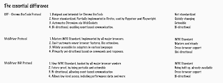
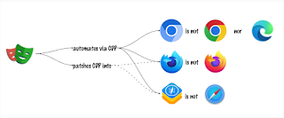
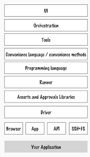
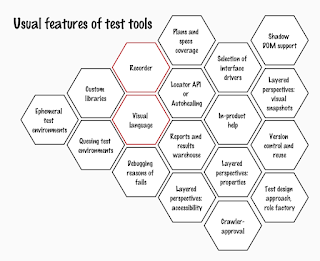
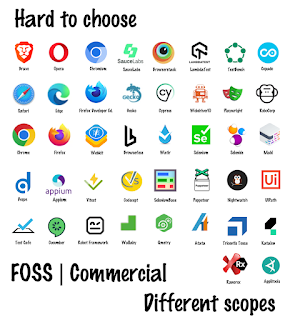

# Complexity draws us to low-code solutions

*Published 2024-10-14*  
*Source: <https://visible-quality.blogspot.com/2024/10/complexity-draws-us-to-low-code.html>*

---

If there is one conversation I find myself having ever since I became a test consultant this June, it is the one of clarifying the space of test automation tool options. There are options. Lots of options. And it is not the easiest of all things to make sense into the options.

Even if I simplify the options to free options and browser testing, I face the conversation of the three:

> Selenium, Playwright, or Cypress?

You may guess it, the conversation even with these is less obvious than you'd think. Selenium is driving a standardization effort, which means that while it supports WebDriver Protocol now, it is already supporting WebDriver BiDi on some of the languages. That is, things are changing under the hood in ways many people in browser automation space will want to pay attention to.

Watching things within the Playwright repo going on in pull requests, it looks like Webdriver BiDi is finding its way into Playwright too. And when that happens, it is an essential change on the overall landscape.

For now with using CDP, there is the definite need of regularly emphasizing that Chromium is not Chrome nor Edge. Webkit is not Safari. Playwright and Cypress, running on CDP don't do real cross-browser testing. The approximation may be sufficient. Single browser testing may be sufficient. But for now, you would need something based on WebDriver Protocol (like Selenium) if you wanted to automate for the browsers your users are using.

To make matters more complicated, the three are not the only options. In the Selenium ecosystem for **testing** purposes, the recommendation is to use one of the frameworks built on top of it like Nightwatch or SeleniumBase or frameworks using WebDriver Protocol without using Selenium like WebdriverIO. Then again, using Selenium as the driver for any and many commercial tools is also an option, and you might not even know what powers the framework under the hood. There's layers.

  

And features.

However, when we talk about these tools, we don't talk about the layers or features. We talk about naming the tools, leaving it for the reader to figure this all out.

The main benefit I find from low code platforms is their closed nature. You don't have to care what is outside the box and you have no control what is inside the box. It probably boxes in things you need to do testing. It simplifies the world. Instead of reading and making sense of all this and all the change to this, you can focus on the work of testing.

Sometimes we argue about the tools so much that focus gets lost. We live with our choices long, and keeping things open has, in my perspective, more value than the simplification.
