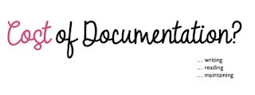

# Code Reviews Have Already Changed

*Published 2025-07-31*  
*Source: <https://visible-quality.blogspot.com/2025/07/code-reviews-have-already-changed.html>*

---

Reading just about anything these days, your mind is filled with doubt: is the thing I am reading written by a person or generated with AI (from a prompt of a person). And that matters because if writing takes 1 minutes, reading it 600 times for 10 second takes 100 minutes. Producing text can be automated. World has changed that way.

Reading was the problem already before generative AI. In my [TSQA talk from 2022 'Something in the way we test'](https://speakerdeck.com/maaretp/tsqa-22-something-in-the-way-we-test), I was addressing the ridiculous notion of writing 5000 test cases or spending 11 working days just reading them through. In the upcoming 2 years after that I learned over and over again that there really was no relevant answers to any of the realistic queries we had with business representatives captured in the 5000 test cases I chose to put to the side.

Reading is an even more significant problem now with generative AI. That makes reviewing before making people read things more essential than ever.

Six months ago I started drafting a talk (without a stage for it to be presented) with the title:

> Code Reviews Have Already Changed

This was a talk that built on the TSQA talk, with a genAI perspective of recent experiences and a call for action in really learning to do what I had another talk formulating experiences with:

> RAGified Exploratory Testing Notetaking

This talk was built on years of experiences of taking notes, and how those were supercharged when using them with genAI in RAG-framing.

During summer break I came to realize that I don't have need of doing talks, so I might just as well write selected pieces into my blog.

So here are my two selected pieces:

1) Selenium open source project year of CodiumAI / Qodo

While active as a member of project leadership group for Selenium, I had fun watching dynamics that I wanted to go back to with research perspective. That is, an AI review assistant was in place, and it had fascinating impacts.

Dehumanized feedback was easier to dismiss - emotion management for giving feedback in code reviews is a real thing, and having genAI generate code reviews generated a stream of silent dismissals UNTIL it finds something relevant that reveals people read. The combo of PRs and chats provides a fascinating record of this, showing that most feedback does not warrant a reaction and is clearly easier to dismiss than real people's review.

Simultaneously, you could see AI lowering the bar for people to try contributing without always knowing what they were doing. Some open source projects went as far as refusing AI-assisted contributions. Others, like Selenium, saw an increased load of attending to people's emotions when they would get feedback from reviews.

Code reviews have changed:

- There is more of them to do, and the first reviewer post AI does not seem to exercise sufficient critical thinking with context
- Knowing something is AI-generated is valuable information to save time on emotion management labour

2) Ownership of generated code / text is hard at work

A colleague in-between-projects was working with me on a proof of concept on a particular combo of platform product + test automation. People in between projects have a lot of time and focus, while those of us in projects have other things going on. Instead of my assistance, genAI was present for a month.

When the day came that I reviewed the code, result was deleting most of it as unnecessary. There same capabilities were already available, and you'd know if you read the first page of the tool tutorial.

"GenAI made me do it" was poor excuse for not reading a definitive tutorial and creating something to delete for a month.

Similarly, more recently, someone worked a week before I was available. On the week I was available, I spent 2 days reading what had been written and trying to preserve some of the work coming before mine, with a lot of effort. Today I learned that I had spent 2 days preserving AI-generated text because you just don't throw away a reported week of someone else's work.

Ownership has changed:

- Your agency is essential. Accepting delays in feedback still causes trouble.
- Knowing your text is AI-generated (include prompts) would be more helpful way of contributing to next steps than generating the text. Protecting feelings costs time.
- Generated text, with knowledge of it being generated, acts as external imagination and sets you up to compete to do better.

If I took the time to put this together into the story I would tell on stage, it would still make a great talk. For that to happen, someone needs to do the work of inviting me because I will not do the work of participating in calls for proposals. And I won't pay to speak.
