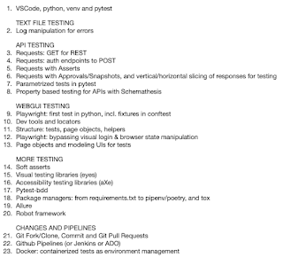
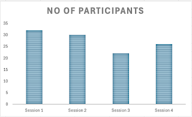

# They Code With Me

*Published 2025-08-29*  
*Source: <https://visible-quality.blogspot.com/2025/08/they-code-with-me.html>*

---

As I was preparing for my summer vacation time, I reflected back on the last year. I made an observation:

> The time I used on thinking/discussing concerns on what people don't know of test automation was more than teaching some of what they may be missing would take.

So I chose to be different.  To live to my exploratory testing values of being intentional, and recognize that *time on something is time away from something else*. I created a rough listing of what I wanted to teach.

I posted an hour long meeting invite for the next 6 months, with the idea that while we cover new ground I continue. And after I taught programmatic testing with python, I will continue with same effort teaching people contemporary exploratory testing. I suspected I could not teach programming without teaching some contemporary exploratory testing too. I invited our testing specialist community, emphasized that this is entirely optional but in me doing things and explaining, there is a chance they pick up something.

I have now run four sessions.

On first one, we learned the conventions around programmatic tests in python, and the tools people would need. We focused on how they would set up test development environments, and how they would know if the basic dependencies work.

On second one, we learned about tests to dig out patterns from log files, given you already had a log file.

On third one, we toured REST GET with a glimpse to POST, and differences of asserts and approvals.

On fourth one, we tried out changing id's in html / javascript files to simulate control over selectors of a webUI application, and created our first test with playwright. We introduced pytest.ini, parametrized tests and giving them names outside the default convention.

I have two options drafted for our fifth session, and because this is something I choose to do for my beliefs, I choose to follow another one of my beliefs: my energy takes us to a good next step, and I track what we explored already, creating intentional overlap to shine light to core concepts.

I have received some positive feedback, but I take these stats as positive feedback. People show up when it is scheduled. More people watch the recordings of me coding, making mistakes but also figuring a way out of those - today with sharp eyes of someone in the audience.

  

I called my series "Code with me: Programmatic Tests in Python". While I wish they really coded with me allowing people to watch us work on this as pair, I'm still happy I am doing something.

I started off this post by referring to **living to my exploratory testing values**. I have put a lot of thought into what those are, for me:

- Agency
- Intent
- Learning
- Results
- Opportunity cost
- Systems thinking

I guess teaching makes a good foundation for learning. After all, we See one, Do one, Teach one. What do you teach to change the community around you?
