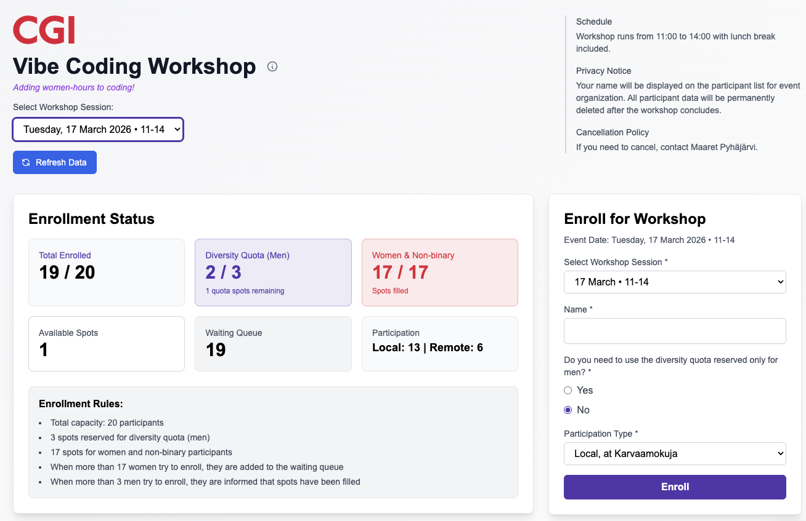

# Quality adventures vibe coding for light production

*Published 2026-02-05*  
*Source: <https://visible-quality.blogspot.com/2026/02/quality-adventures-vibe-coding-for.html>*

---

The infamous challenge to a geek with a tool: "we don't have a way of doing that". This time, I was that geek and decided it was time to vibe code an enrollment application for a single women to women vibe coding event with diversity quota for men. That was a week ago, and it's been in "production", bringing me tester-joy, allowing 38 people to enroll and 2 people run into slight trouble with it.

What we did not have is a way for enrolling to this event so that the participant list was visible, quota of how many people joined monitored, with possibility to have a diversity quota. Honestly, we do. I just decided to fly with the problem description and go meta: vibe code enrollment application for vibe coding event.

The first version emerged while watching an episode of Bridgerton.

While letting the agent code it, I did some testing to discover:

- the added logo was reading top to bottom instead of left to right in *Safari*. I know because I tested.
- boundary of 17 is 17, and boundary of 3 is 4. Oh wait, no? Comparing two things the same way and one is different and wrong.
- removing a feature, emails, was harder than it should be. When it was removed, there are three places to take it away from and of course it was left in one and nothing works momentarily.
- there was no retry logic for saving to database - who needs that right? Oh, the two people whose enrollment will get lost and they tell me about it.

With that information, off to production we go. True to vibe coding mentality, there is one environment: production. People enroll. Two people reach out that they are sure they enrolled but their names vanished. I was sure that was true and lovely that they let me know, but they managed to enroll, just a few places lower in the waiting list than what would have been their fair positioning.

Less than a week later, the first event is almost fully booked and the queue is longer than what fits in an event. We decide a second session is in order, and that's back to more vibe coding. Adding two features, selection of day from two options, and time-limited priority enrollment for those already in queue for first event who want to join the second.

  

Armed with some extra motivation for the final episode of Bridgerton, I decide to go for the known bug too. Asking for fix requires knowing what fix to ask for. And while at it, I asked for some programmatic tests too. And reading security warnings on Supabase. Turns out that combo made me lose all my production data in an 'oops', since one browser held a full list of participants while one showed none, and as it happens the application removed all lines from database to insert new lines based on what was in local storage. For a moment I thought this was due to removing anonymous access to delete in the database.

So added more bugs that needed addressing while at this a second time:

- every users local storage contents overwrote whatever was in database by then. Almost as if it was a single user application!
- there were many error cases that needed handling on the write to database failing in the first place to not lose people's enrollment information. They did find it (not surprising) and got in touch for it (surprising). I guess DDoS day was not in my plans when expecting network reliability.
- security alerts (that I read) in supabase alerted me on security misconfiguration with out of box version.
- Lost all data for testing in production! At least I had a backup copy of all but one row of data.

Funny how it took me two sessions to start missing discipline of testing: separate test environment; repeatable tests in the repo.

I'd like to think that I am more thoughtful when turning from vibe coding on hobby time to doing AI-driven software development at work. The difference in those two feel a whole lot like great exploratory testing.
