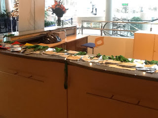

# Open letter to No-Shows at a Free Conference

*Published 2013-12-16, updated 2017-07-23 · Labels: Public Speaking*  
*Source: <https://visible-quality.blogspot.com/2013/12/dear-all-prospective-conference.html>*

---

Dear all prospective conference participants,  
  
In
efforts to make things better for the future, I wanted to share you my
perspective from something that happened last weekend at Tampere Goes
Agile 2013 -conference. A lot of people, about 60 that had enrolled did
not show up at the conference. In addition, there were about 20 people
who cancelled in advance during the last week, when the per participant
cost has been fixed to a level regardless of if you let us know or not.   
  

**Picture: these badges were left without their owner (We know who you are)**

Some
people feel really upset about this. The hard reality is that we payed
41 € / person who we reserved a space for, and with 80 no-shows, there
is a sum of 3280 € +VAT 24% that we could have used on other things like
beer at the location for those who were there. If we would buy beers
that cost 8 € / unit for end users, we missed out on 508 pints of beer,
that is over 2 units / person at the conference.

I
feel that it is your right as a member of these free-form communities
to reserve a spot for you and take that cost to be allocated for you. If
you were present at the location, I could see you not just as cost
factor, but a factor that brings the community value through your
skills improving and you contributing to the learning of others and the
overall atmosphere of the conference. The same idea of value is
relevant for every participant at the conferences, the organizers build
these places to meet up with others to generate value that would not
happen if we did not discuss actively and build on each other.

This
year we increased the limit of participants so that everyone from the
wait list could get in if they wanted. But letting people know on last
week or during the conference day does not work. As agile as we are, we
should also remember our responsibility to think a bit in advance on
those things where that makes a difference - like reserving a place in a
conference where you don't show up.

In summary, I kindly ask all of you going to conferences, to keep in mind these:

- When you participate actively, you create value that takes our community forward
- When you enroll and don't show up, you become cost that creates no value.
- Critically think about your possibilities to be there over a week in
  advance, but if you end up sick, don't feel obliged to show up just
  because you think you promised something

There's been plenty of ideas of how we would do things
differently because the badges left behind made the problem visible. We
could:  

1. Stop making free conferences - all conferences cost something and "only money makes people committed to their enrollments"
2. Charge money that you give back when you retrieve your badge, like a deposit - but work isn't free either
3. Put the no-shows on waitlist for next year when they enroll and
   confirm their spots only when those without the no-show history have
   acquired their spots
4. Hand out twice the amount of places and hope that the no-show rate
   remains the same, or give the benefit of food & coffee only to N
   first people on the registration desk, N being the number we officially
   announced we would have. If lucky, there is no N+1...
5. Use more money on the no-shows so that they create value - give 20 €
   on their name for a cause that publishes a list of donators, so that
   they become donators for not showing up. Tell about this in advance.
6. Organize only conferences where presenters get in. They tend to be
   then more committed to showing up, and make good participants too.

You could probably come up with other great ideas. Personally,
I'm not open for anything that makes you feel any worse than you already
should since you missed out a brilliant conference regardless of what
was your reason. I believe many of you would have seriously wanted to be
there and I hope to get the chance to see you there next time.
