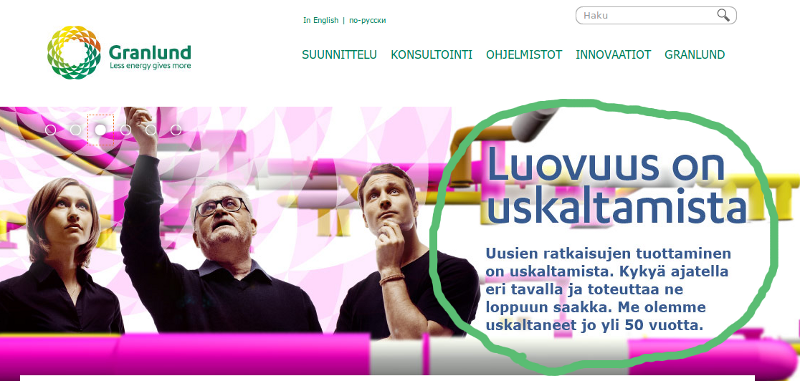

# Power of stories and how a one hour presentation changed the world around me

*Published 2014-11-06*  
*Source: <https://visible-quality.blogspot.com/2014/11/power-of-stories-and-how-one-hour.html>*

---

This blog post is about appreciation that I almost forgot to express, and my public thank you for Henri Karhatsu for doing something small that changed  a lot.  
  
Last spring, I was trying to find ways of helping my team's developers be injected with new ideas. I brought in two people from the community to talk to my teams for an hour each. The other talk was technical talk about single sign-on, and the other [an experience report, story on #noestimates by Henri Karhatsu](http://www.karhatsu.com/granlund/).   
  
Henri's one hour at my organization had a huge impact - it has literally changed the world around me.  
  
For my first team, it was the trigger for moving to continuous deployment through giving up estimates, and built on that experience, it has changed the tools we use and atmosphere we work in. It served as empowerment for people to start acting outside their perceived roles, and start trying things. This team had everyone in the presentation. The day after the presentation, estimates were removed and since then, a lot of other waste too.   
  
For my second team, the message stuck with the developers but empowerment to act on it was only found later. The team continued for several months estimations and I feel part of the delay came from the fact that the story was not shared for the whole team as the project manager had not been in the presentation. This team too is now much lighter on estimates, and with support of an external coach, is learning more about how to change things and to take the best out of what we've got.  
  
Henri did his talk as a favor for me, and looking back, I can only wonder why did I not understand to ask him for a visit sooner. This blog post is my public appreciation for a small thing in the community that made a huge difference in our organization. Ask people to share their stories for your organization. A small, short talk based on an actual experience can change the world. You learn who has great stories by going around in the community, and people sincerely want to help. It is wonderful.   
  
This particular story was delivered with a personalized end message:  

This picture is from our company web page, stating a message "Creativity is courage / daring". Henri came with a personal story that he brought back to a message that was key to what our organization is. And with that, we found the courage that was missing, and I should have remembered to tell him sooner how much I appreciate what he did for us.
