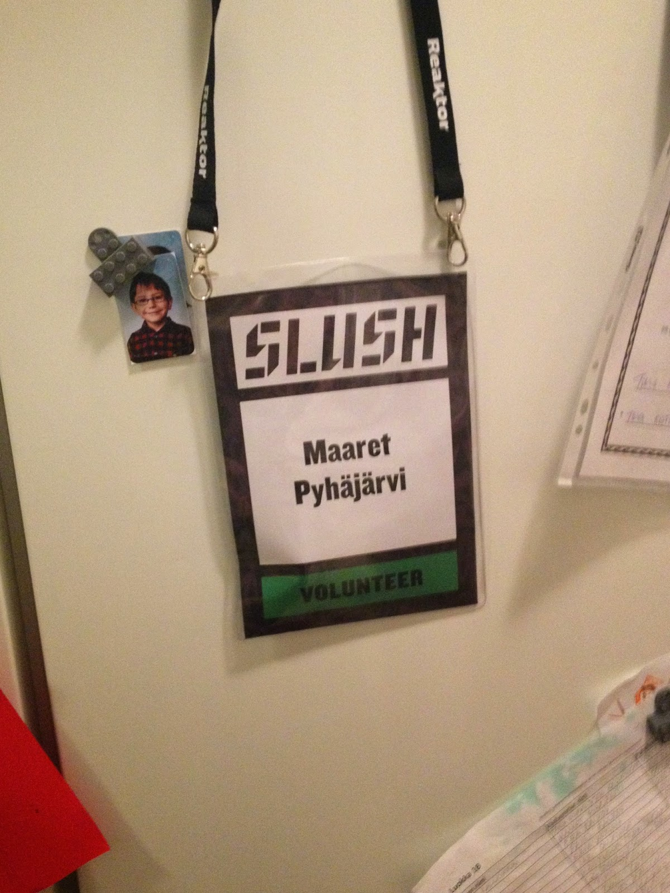
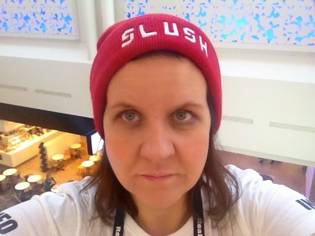

# Learning by Doing: a conference volunteering experience

*Published 2015-03-31, updated 2017-07-23 · Labels: Public Speaking*  
*Source: <https://visible-quality.blogspot.com/2015/03/learning-by-doing-conference.html>*

---

In addition to my ambition to become the best tester I can
be, I’ve had a secondary goal to support the first one. I’m getting very close
to being able to call myself a professional event organizer. The number of
events I’ve put together is large, ranging from small group events to professional
conferences and parties for 2000 people. I’ve been the main organizer for
Tampere Goes Agile (140 – 200
participants) and Helsinki Testing Days (500 participants), and I’ve had great
time in the EuroSTAR program committee as one of its members. I have never been paid salary for organizing,
it’s always been a hobby.  
  
 Organizing is my means to reaching all the wonderful stories
that help me grow as a professional. It has taught me a mechanism to ask for things
I feel I need, as I’m not alone with my interests. 
There was however something I really wanted to still learn
about. I wanted to learn more about how to put together a huge conference and
include hundreds of volunteers in the organizing. There’s no better target in
Finland to learn that that Slush, the wonderful startup conference.  
  
While some other people might ask a Slush core organizer /
volunteer responsible for a lunch and chat, I do things differently. I
volunteered amongst the hundreds of people, everyone 20 years younger than me and
served as one of the infodesk people for the duration of the conference. And I
got to see what it really is – and meet wonderful younger people who are active
enough to change the world a little in their turn. Also, I got to experience
how invisible that position made me in the eyes of my colleagues who I would
see participating and not recognizing me at all in the unexpected position and
attire. I never ever wear a beanie hat - except now I did.  

Here’s my observations from within with lessons learned:

**It’s about hierarchy and overstaffing**  
Slush volunteer recruiting is hierarchical. First they recruit, usually from
personal connections, the team leads. For example, there were three info teams,
each with their own leader. There was a clear vision of volunteer teams that
they would staff. And having a team that was rather too big than too small was
a way to manage the no-show risk with volunteers.   
  
When something needed to go up, there was a clear hierarchy of who helps with
what and whom to escalate problems to.  
  
**Responsibility of an area creates self-organization**  
There were a lot of things the info team would not know beforehand. I found it
quite admirable what my team lead did. She communicated an overall vision of
what we’re responsible, and introduced tools to make notes of what we had
learned in first hand contact with customers. We were all encouraged to use our
best judgment, as the answers would not be always available. There was a
customer problem to be solved, and many solutions would do.  
  
**Personalized communications**  
During the whole volunteering experience, I got only a few generic emails that
were sent to all volunteers. Instead, the communications also followed the
hierarchy. Messages were sent to team leaders, who in turn personalized them
for their own teams, no forwarding. This in particular is a huge difference to most of the conferences I get to participate in in a speaker role.  
  
**Working in shifts**  
Over the timeframe of conference, each volunteer was expected to work about
half of the conference time, leaving the other half open for participation.
Thus you got a free conference entry for volunteering. All day-time conference
volunteers were free by evening party, and had access there.  
  
**Training the volunteers with style**  
Slush had Bruce Oreck run workshops on how to handle customer connection and
create unique customer experiences. It was partly motivational, but focused
also on tools on how to be yourself and deliver things your way. The contents
were one thing, but the fact that they have a “big name” training the
volunteers surprised me. Someone had really put some thought into that.   
  
Both the training sessions and the info sessions with informal parties
afterwards seemed to build a sprit of exclusion: those who were there, were
treated as if they are special. And they are.  
  
**The amount of volunteers**  
There was a crazy amount of volunteers, several hundreds. During the
conference, I heard that the volunteers don’t usually just show up even if this
year is easier, but recruiting is work that they do continuously. They visit
different schools to talk about Slush. They work hard to make volunteering
cool. The trainings, the parties, being in the great event, and a work
certificate are all things they’ve decided on.  
  
**Recruiting volunteers in order of unpleasant work**
With the different teams, the first team to recruit was the team that I found
that had least pleasant job. Not sure if this was as intended, but would make
sense. I probably was not the only volunteer to say no to carrying stuff
around, instead later on when contacted about customer-facing position in the
frontline, I would say yes.
