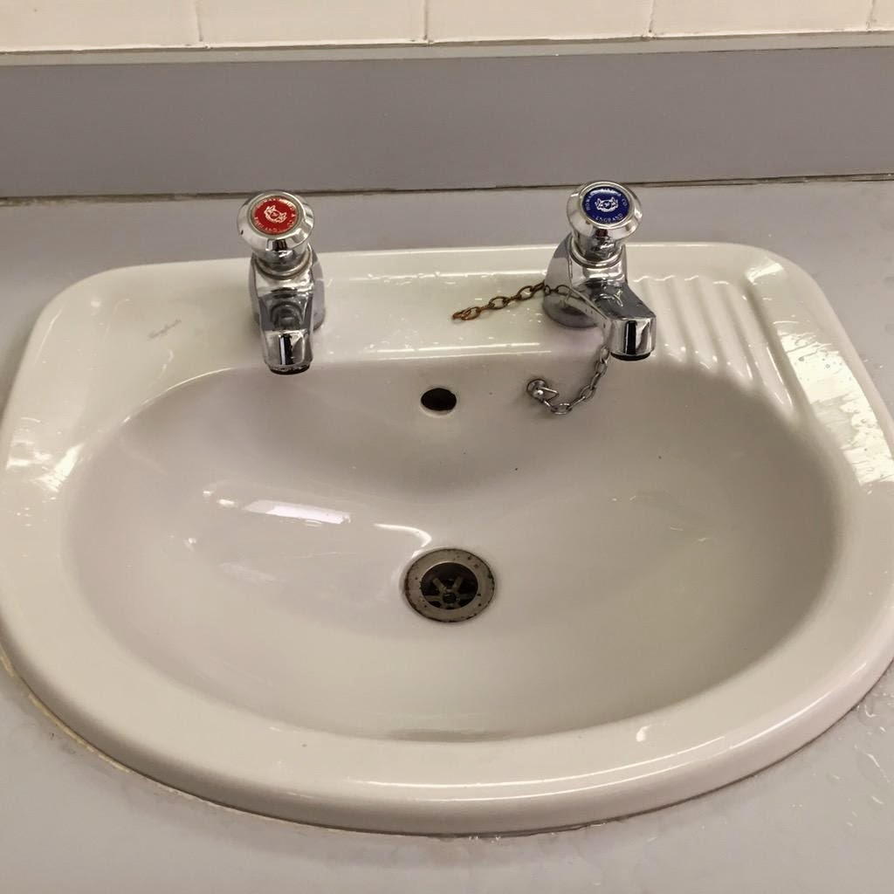

# Organising Women-only conference

*Published 2015-04-19, updated 2017-07-23 · Labels: Public Speaking*  
*Source: <https://visible-quality.blogspot.com/2015/04/organising-women-only-conference.html>*

---

I volunteered with [Speak Easy](http://speaking-easy.com/) and am now organising Speak Easy World Tour 2015 as the international conference chair. It's a 'unique female conference' providing a stage to give room for female voices and experiences of testing to be shared, and it will be video'd and thus shared for crowds larger than the local participants.  
  
For quite some time, I've been thinking of setting up a signature webinar series, as a chance of getting your talking work sample - the best one - shared and promoted. And with the world tour emerging, I feel it is one step towards having more samples available out there, when considering new speakers.  
  
I'm usually very careful with women-only conferences. While in the masses of great people who want to share stuff of testing is so many women that you really don't need to choose based on gender but content, I've grown to appreciate the idea that balancing the availability of female samples and stories with women-only conference is good. However, I would hope the contents reach a diverse audience of both genders.  
  
When deciding I would support this by volunteering, I had a discussion with a friend. She feels even more strongly than me that we shouldn't do separation. Separation is unnatural.  
  
What is unnatural is however cultural. It's seriously unnatural in Finland which I find to be a very gender-equal place in general. It might not as unnatural for countries where all-female schools still exist or where the culture is essentially more patriarchal.  
  
It's as unnatural as the water taps in UK. Seriously, how do you wash your hands when you have to get separate taps for hot and cold?  
  

  
Organising a women-only conference is a bit like these taps. We open only one of the taps to let in ideas from that group. We'd really want them all coming out from the same tap, but meanwhile, in culture change, we just need to find another way to mixing things to be just right in balance.  
  
Another friend reminded me that women in medicine were not invited, welcomed and helped in either. They just decided to show up and that is what we should do in general. I think I might need to get over my "invite me and I show up" idea, which is just playing with the general observation that technical speaker women are not that common and expecting special service. The friend had a point: in his life, he has heard more "no" than I have, because he asks. That goes for personal life as well as professional.
