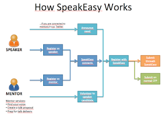

# My approach to being a Speak Easy Mentor

*Published 2015-11-19, updated 2016-08-02 · Labels: Public Speaking*  
*Source: <https://visible-quality.blogspot.com/2015/11/my-approach-to-being-speak-easy-mentor.html>*

---

My first [Speak Easy](http://speaking-easy.com/) mentoring process is now over. [Ru Cindrea](http://twitter.com/ru_altom), my mentee and my friend, has delivered her first international talk at Better Software Conference in Florida. I could not be more happy for her. She did great. She is great.  
  
If you don't know what Speak Easy is, go look it up. It helps speakers get started with speaking through mentoring. The punch line is **diversity**. For me it means women. It means people who wouldn't talk otherwise regardless of gender. It means new stories and new opportunities to learn through other people's experiences. It means growing new experts locally, and sharing them with the world so that there will also be strong European voices. Mentors are people from the community, who volunteer, each for their own reasons. It's all free and voluntary.  
  
I'm now through one mentoring process, and half-way in another, and my approach to this is starting to shape. I'm very curious how other Speak Easy mentors do this, so I thought to share my way.  
  
**It's really a process**  
  
I seem to take my mentee through steps, that turn into six Skype sessions of varying length. From my very first assigned mentee (who got lost somewhere), I learned to agree on the next step while completing the first, and to rely on Skype meetings rather than emails.  
  
Step 1: Introductions  
  
In the first meeting, I tell about who I am, find out who my mentee is and talk about the process my way. I commit to being available and set Skype face-to-face as the mechanism. We talk about the minimal deliverables - like you don't need your slides early on, but they DO help clearing out your abstract a lot if you work on them early.  
  
We talk about what type of talks my mentee would find relevant. I share my bias towards personal experiences over great ideas / theory, to probe for compatibility.  
  
We talk about conferences that are out there, and their special characteristics. I'm usually aware of submission schedules, so I can share those. We look at testing conferences, and software development conferences if those seem fit for my mentee's interests. I point my mentee to speak easy site, but also emphasize that it has just conferences that reserve a special slot for Speak Easy applicants. You can also apply directly, with others.  
  
While I have an idea of steps forward, I introduce only the next step. I leave my mentee thinking (mind mapping) about what experiences would be worth sharing, and what lessons those would deliver.  
  
With Ru, this step was a funny ad hoc mixture. We were in the same online space at the right time, when it was time to submit for the Speak Easy quota. We realized that while Ru has spoken locally, she hasn't internationally. So we fast-forwarded to a specific conference by chance.  
  
Step 2: Finding your talk and places to submit  
  
In the second meeting, we go through my mentee's ideas of what to talk about from experiences. I share my insights on what in those ideas excite me, which I like best and think would fill real needs conferences have - all from my perspective. I emphasize that if something I'm not excited about would be something my mentee is excited about, that is still the one we should go forward with. Speaker first. The conferences will make their calls on choices and my view might be very different than theirs. And there's the right place for every talk idea in the world. Some belong in international testing and software conferences. Others belong in local meetups. And they might grow up to belong to bigger arenas too.  
  
Learning to speak locally is a great thing to do. I emphasize local speaking as an opportunity to practice. Fail (and learn) in small scale, safe environment. And you won't fail anyway, just stumble a bit occasionally.  
  
With Ru, finding her talk was a step that happened before I became her mentor. We were traveling and talking about inspiring lessons in projects, and I was trying to understand her experience about signal detection theory. We shared amazing stories about the worst bug she has had to deal with, the intimidating "reproduce or get fired" -scenarios that sound like a bad movie and how many troubles with dealing with bug reports just made sense after taking BBST Bug Advocacy course. I knew she needed to deliver this somewhere. So the idea was there when the deadline to submit was approaching.  
  
With my second mentee, I was very proud of her sharing five selected topics and her experiences in those. We prioritized them together. As the next step, homework was to work on the title and description.  
  
Step 3: Creating the abstract  
  
In third meeting, we work on the abstract. I have the idea that it could be that I review the abstract and give feedback. But more often it is about finding the essence and motivation of the talk so that we can together get that on paper.  
  
To find the essence, it's either about mindmapping or about discussing around slide outline, without yet focus on the slide specifics.  
  
I'm learning to pair better with the abstracts. My second mentee made me particularly happy asking to create the abstract together in the session, instead of resolving to the write-review cycle. Perhaps she is a particularly good agile tester, and that shows in her collaboration skills.  
  
There's still a bad habit I have on me joining the writing, writing options and contributing my ideas that way. There's still too much magic in the thinking that happens when my fingers touch the keyboard. The magic vanishes sometimes when I pair. Pairing is a skill.  
  
The ideal case is that the third session happens before the submission process. But it could also be that the third session is, like with my second mentee, after being accepted to deliver the talk in an international conference, with the expectation that the abstract needs to be improved.  
  
Step 4: Creating the slides  
  
In fourth meeting, we usually work on the slides. There's a lot of homework for the mentee before this. Most often the skeleton of the slides starts to form clearly by this time. But how the message is structured might be very ripe. Typically we talk about making the talk more lively with stories. We talk about splitting the messages so that they can be digested better by the listeners. We talk about storyline, contents of each slide and the number of slides in relation to the idea of style of delivery.  
  
With Ru, she just pinged me when she had draft slides available and I read them, knowing her story already and filling the blanks. I left comments, and we talked a bit over Skype. And later she pinged me again having changed them completely without my comments, and again we discussed feedback.   
  
Step 5: Deliver the talk to me  
  
In fifth meeting, I volunteer to listen to the talk. While I have been speak easy mentor for only a while, I've offered similar services to people before. Talk, deliver, I listen and give feedback. Real audiences tend to be polite and avoid negative feedback, I will speak about that too and work through ways of improving.  
  
We talk about feeling, perceptions and take-aways. It's safe. It's just me. And we both now it's not ready, it's not what you're measured against. It's just practice, it's for improving.  
  
With Ru, she delivered the talk to me and her colleagues at Altom simultaneously. We had great reflective feedback of what we liked and what could still be improved. None of it was absolute. Feeling, observations, ideas. Use what you find useful. Discuss, reflect and find your way.  
  
With other people, I've had sometimes several deliveries. Seeing the talk grow through feedback has been very rewarding. It was always there. It just needed to be revealed. And I could help with that.  
  
I advice people to practice with others too. I push my mentees to local user groups. I had one set up in Helsinki for Ru, but scheduled turned out to not match, so other people (including myself) used the session for practice of international talks. With these sessions, there's usually more time for discussion, and you can actively invite people to give you feedback. Or you can just look at how engaged you feel they are during your session. Or both.  
  
And then there's the ultimate practice: delivering the talk. I wish I could be there. But I might just be around twitter, following what people say and bring out as their lessons. I admire Huib Schoots for showing up to see his mentees perform. He had a few of them at TinyTestBash. That's presence and support.  
  
Step 6: Post-conference mentoring feedback  
  
When it's all done, I want to still close with a bit of reflection. How did we do and what did we learn? Mentoring is always a learning experience for me too.  
  
With Ru, I learned that some conferences focus on word count and style - and that there are guidelines that no one mentions when submitting, but when you miss them, the feedback can be harsh and hits both of us.  
  
With my second mentee, I've already learned that being available with deadlines of submission and me volunteering does not always work out. And when the "improve" email comes, it hits both of us. I hope it softens the blow for my mentee. And I've learned we should really focus on doing, not talking - pairing is great.  
  
**Other reflections**  
  
Now that I wrote out my process, I also notice there is another difference. I find my mentees from twitter and I register with them for Speak Easy. Others seem to find their mentees through Speak Easy, they have a matchmaking service. I enjoy working with people I've met and believe will deliver great sessions as we'd had a chance to chat before. So I tend to not let Speak Easy know of my availability, it's always subject to inspiration. If you would want me to mentor you, a good advice is to ask me directly. I will if my bandwidth allows.  
  

In this picture, I prefer the outer route. With end points, I've now had one of both. One using the Speak Easy Quota, one using regular conference submissions.

Speak Easy is great. Thank you Fiona Charles and Anne-Marie Charrett for setting it up!
