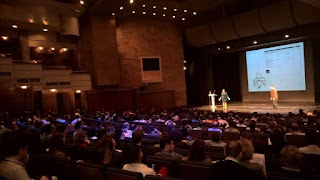

# Six months into the speaking year 2016, what changed?

*Published 2016-05-04, updated 2016-08-02 · Labels: Public Speaking*  
*Source: <https://visible-quality.blogspot.com/2016/05/six-months-into-speaking-year-2016-what.html>*

---

When you blog about your goals and ideas in public, it also serves as a foundation to realize that things did not go quite as planned. I wrote [a blog post about my 2016 speaking goals](http://visible-quality.blogspot.fi/2015/11/technically-speaking-and-public.html) in November, and six months later, it is clear it turned out different.  

**Give a high-profile keynote**  
  
With me, high profile means some of the known names of testing conferences that do keynotes. I'd say it is safe to say by this time of year that I will not be keynoting in a high-profile conference this year.  
  
Then again, I can redefine high-profile to mean some of the great opportunities I've had. I was invited to speak at Agile Testing Days Scandinavia, and the audience reactions (questions, discussions, learning - love it!) were so worth it. I did a paired talk with Llewellyn Falco in front of a large audience at Agile Serbia. And it looks like autumn will include an invited talk (even if not a keynote) in a testing conference I adore, and a keynote in a new conference.  
  

  
  
**Publish 2 talks as videos online that wouldn't happen in conferences**  
  
I've published a couple of short videos on my own YouTube channel, and contributed three webinars in the community. I have a backlog of talks I'm not sure where I will do that just need to  get out, and webinars with the community players seem like great opportunities. I've also been toying with the idea of just doing a webinar series of my own, or starting a podcast to feed the need to learn through sharing.  
  
**Less talks at conferences, just 3 (scheduled 2 already)**  
  
I promised myself I would go out less. I did, but not in this drastic level. From 33 sessions in 2015, I'm now committed to only 20 = 16 + 2 +2 (public + agreed + in discussion). I'm doing slightly better on not paying to speak - only four of those. But that is four more than I told myself to do. I decided to pay for speaking at Devoxx UK (time to try my developer-conference wings),  at Agile 2016 (family reasons to be there for a week), at a test conference in Latvia if they'll have me (supporting the community) and at Mob Programming Conference (long story).  
  
**Some workshops at conferences, as paid work (at least 1)**  
  
With this goal, I'm there with the wonderful TestBash pre-training. I had so much fun. And I'm learning that breaking into this circuit is a long term game, many have already all the sessions for next year laid our already.  
  
**Coaching 2 new speakers - finish one in progress and start one new**  

I've coached a lot more than 2 new speakers this year. I think I'm at 7 now. The ones in progress stick with me and come back with new ideas to review and that is wonderful. And new ones emerge both through Speak Easy and directly.  
  
I've also taken my 1st mentee who I teach testing pairing with her regularly. She can teach me automation, I can teach her exploration. It's a win-win. And the world will end up with two more awesome testers than what either of us could be individually.  
  
**NEW GOALS**  

I'll just say I'm changing my resolution here. I'll be going around to places where there's awesome people to connect with. Speaking is much easier for me than mingling and smalltalk without speaking, so I just need to speak to overcome my social awkwardness of assuming people might not want to talk to me unless they come to me first.  
  
Speaking is not about status, it's about learning. There's no better way to learn than to share and invite people to help you learn more. Try it and let me know if I can help. It's always a win-win.
