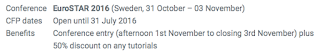

# SpeakEasy looking for EuroSTAR speaker

*Published 2016-06-07*  
*Source: <https://visible-quality.blogspot.com/2016/06/speakeasy-looking-for-eurostar-speaker.html>*

---

[Speak Easy](http://speaking-easy.com/) is a diversity program that works on bringing new voices to conferences on Testing. The way they work is  that they pair up mentors and new speakers, and they have agreed special channels to various conferences outside usual Call for Proposals. Speak Easy is awesome, and that is why I volunteer with them as a mentor. We need the new voices in the field.  
  
Currently the Speak Easy call for EuroSTAR conference is open. I would really love for them to get the best of the world of new speakers, so this is my call for any new-to-international big arena's speakers to sign up!  
> Want to speak at [@esconfs](https://twitter.com/esconfs)? Novice speaker? Apply to the [@spkeazee](https://twitter.com/spkeazee) programme<https://t.co/VbKIN5je4n>
>
> — TEST Huddle (@TESTHuddle) [June 7, 2016](https://twitter.com/TESTHuddle/status/740020507995672576)

The Call for proposals is open until 31st of July, so you have time to act!

  
This call also gives me a chance to announce an experiment we're running to change the world of conferences. EuroSTAR is a typical what I call "pay to speak" conference, that I have had trouble submitting to because they give the conference entry but do not pay for the travel + stay (or lost income).  
  
I want things to be different for someone who came after me and had similar feelings. So we're **launching a scholarship to pay for the travel + stay for whoever gets selected**. Don't let the cost of the travel keep you from proposing the talk the conference audience deserves to get!  
  
Lost income I can't help with (yet), but will figure that out eventually too.  
  
Show Speak Easy what you've got. Submit. And if you feel you could use help in formulating what you're talk is about, I'm still one of the people who are happy to help with that.  
  
The world of testing conferences needs you. Start the process of getting your voice out with Speak Easy EuroSTAR 2016. And when you get a no (most people do), you've already worked out the first step to do that talk in other conferences and local meetups that are just waiting for people like you to volunteer.  
  
\*\* Who is we? That is organizers of the European Testing Conference and me leading up front as the main organizer. I want to see things be better.
