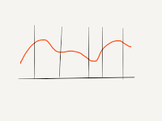

# Visual Talk Feedback

*Published 2016-08-24, updated 2017-07-23 · Labels: Public Speaking*  
*Source: <https://visible-quality.blogspot.com/2016/08/visual-talk-feedback.html>*

---

Last spring, a Finnish colleague was preparing for his short presentation at an international conference. I've had a long-going habit of practicing my talks with the local community, and he decided to do the same. He invited a group together to hear him deliver the talk.  
  
It was an interesting talk, and yet we had a lot to say on the details of it. Before we got to share what was on our mind, one of the people in audience suggested a small individual exercise. We jotted down the main points of the story line chronologically on a whiteboard together. Then each of us took a moment to think how engaged we felt at different points of the presentation. Finally, we all took turns on drawing our feeling timeline on the whiteboard.  
  

  
What surprised us all in the visualization was how differently we saw what the engaging key takeaway moments were for us. A diverse group appreciated different points!  
  
Knowing the overall frame of some of us liking almost all parts of the presentation provided a great frame for talking around the improvement details each of us had. It also generated improvement ideas that were not available without the image we could refer to.  
  
Today, I was listening to a talk in a coaching session over Skype. I was jotting down the story line and thinking how I could visualize the same thing online. Next time, I'll get Paper on iPad out early on and share that with who ever I'm mentoring. It will provide us an anchor to see how the talk improves. And it gives a mechanism of inviting your other practice audiences to engage in giving feedback.
