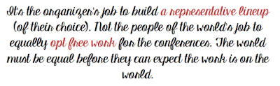

# Conferences against the structural problems

*Published 2016-09-24, updated 2017-07-23 · Labels: Public Speaking*  
*Source: <https://visible-quality.blogspot.com/2016/09/conferences-against-structural-problems.html>*

---

I've been buzzing around all morning organizing all the things that need organizing before I jetset off to New York to do a keynote at the Test Master's Academy conference. That's kind of awesome. But simultaneously, it's not. It's a lot of (unpaid) work. Just like any other conferences where I speak. I have higher expectations for this one than many others, as I've been positioned to be the opening keynote and there are some internet friends I look forward to meeting.

If you take a look at the conference lineup, you see plenty of men and women, and even people of color. There's people who are believers in exploratory approaches, and people who are keen to see automation rule to world of testing. And it's all amazing, just as it should be.

But like I said, the speakers put a lot of work into conferences. There's the time for traveling (that isn't paid time even when the conference is). There's the time of organizing all the things that need organizing for being away. And there's the time for the conference. I have a great chance of actually enjoying this conference as I get to go first. Often times, I'm preoccupied with my preparations throughout the conference.

So I wonder, many times, if this all is worth the hassle. It's fun and all that, but is it really giving me as much as it is taking from me?

Then I enter the twitterverse and see this:

> 20% of [#testbash](https://twitter.com/hashtag/testbash?src=hash) Brighton applicants were women. Come on ladies, you should all be submitting more if you want a better balance.
>
> — Rosie Sherry (@rosiesherry) [September 23, 2016](https://twitter.com/rosiesherry/status/779429549406883840)

  

I retweeted it with my note: "There's a systemic problem under this, as the kindest and most encouraging of us see this. It's not up on women but the allies to change this".

Allies is a word I don't really like, but I lack a better word. I mean men who care that the world changes to be a better way for their daughters, partners and friends in the underprivileged groups.

The first step is to recognize there is such a thing as privilege, and I appreciate it might be hard. I have tons of it, even if I lack some. I'm a woman of a certain age (love the term and just learned that from Sandy Metz) which gives me courage I did not have when I was younger. I'm very white and from a society that has given me opportunities I wouldn't have had somewhere else. Privilege is a special right, advantage, or immunity granted or available only to a particular person or group. As someone who is underprivileged, [it takes you more work to get the same done](https://medium.com/thoughts-on-society/why-do-women-try-to-get-ahead-by-pulling-men-down-a1345b36b91b#.x47xwr4se).

When talking of women, I hate talking of minority because where I come from, women are equal in numbers in conference attendance and work places in the *field of software testing*. Women are not a minority, but they are underprivileged. Even where I come from, often a majority of speakers in testing conferences are men.

It's clear other conferences end up with a different result because they balance out by not just encouraging submissions but inviting specific topics and people. And that is justified because of the systemic forces that are against women.

- Less women are encouraged to speak for their companies in public.
- To get to be considered the one at your office who gets to go (or even submit), you need often years of work against the corporate cultures in IT favoring men.  To get to a speaking position, you might need to keep all your focus on keeping that position instead of donating time for free for conferences that are businesses.
- Women tend to carry a bigger load of the emotional labor (organizing family life) than their partners and thus have less time available to use.
- It can be harder to find time to be away from other duties, it can require direct financial investments and include a mental load from judgement on the choices you've made on leaving family behind.
- When speaking, you're continuously facing "chosen for gender" allegations.
- When speaking, you need to exert extra effort in [presenting yourself in acceptable tone](https://www.facebook.com/humansofnewyork/photos/a.102107073196735.4429.102099916530784/1362452657162164/?type=3&theater).
- You feel you need to be good, not average to justify your existence.
- You need to work against the stream, with lack of role models.
- You need to accept that your feedback can be more harsh and personal just because of your gender.
- It's common to ask (unpaid) diversity work from minority groups over offering to pay them for the work they do.
- It can be harder to find the extra money to even loan for the conference on expenses if it comes out of your own pocket even if expensed later. You will know you chose a conference over something for your family and there's a gendered expectation on how the choice must go.
- Coming back from a conference, it still feels women report on the harder treatment of the "stupid ideas" they pick up.

When the problems are systemic, it's not up to the underprivileged group to change it. It's up to all of us to change it. Conference organizers have a lot of power in the change if they choose not to be passive victims of the system.

After a discussion with a friend, I managed to sum this up in just a few sentences.

What the conference organizers can do:

- Pay for the work. All the work. Including submission work. When you stop thinking of submissions as your right to free labor, you start finding better ways of investing your conference budget than call for proposals. Good proposal is hard work. My talks tend to take me a week of work before 1st proposal.
- Pay on time or early. Yes, I know it is hard because you don't have the money yet. Stop treating speakers of the world as a loan office. The underprivileged are less likely to submit when they know they have to admit to being challenged in this.

Before numbers like 20 % women submitted are relevant, we need to consider what are the reasons that stop women from submitting and be open to the possibility that their reasons might differ from the reasons provided by men. And if 20 % of a 100 proposals is 20 talks for a conference that needs 10 talks in total, that might not be a bad situation at all. There's an actual potential for an all-female conference.

  
Why would you? Because you believe that diversity means learning from people different to you makes the world a better place. Being representative would be important as different backgrounds bring different lessons. I do, do you?
