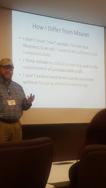

# Slide incident, the long version

*Published 2016-09-28, updated 2018-12-26 · Labels: Public Speaking*  
*Source: <https://visible-quality.blogspot.com/2016/09/slide-incident-long-version.html>*

---

I tweeted an image yesterday from James Bach's conference talk.  
  

  
  
Let me be clear: I don't think it was ok to have this slide in the deck. It was less ok to spend a good ten minutes on it only to be interrupted by the audience half-way through explaining with "could we move to hearing about how the tester roles changes?" - the talk topic. If there was a critique of my morning keynote, the place for that was the time reserved for it after the keynote where there was a brilliant facilitator ready for that discussion. Or if this was indeed the place for this critique, I was there whole day available for a little chat to clarify facts.  
  
*[Edit: I object to James using his keynote to mischaracterize my person. He did not take my claims but his perceptions of me as a person. I'm calling for is James to focus on claims / content and fact-check what he presents. He did not. Please don't claim I'm saying you can't reference other people's work.]*  
  
The slide isn't quoting me. It's stating how James Bach differs from me. And surely, I prefer to be nice and kind, and care for safety of others in addition to mine. Right now I'm less worried about my feelings (I'm ok, just emphasizing this is \_unacceptable\_) and more worried of the impact attacks like this have on the speaker community so many of us work so hard to build.  It is not safe to have this behavior.  
  
I've been second guessing my choice of sharing this, because if only people in the conference knew this happened, it wouldn't scare others. But it still happened, and being quiet about it isn't really a choice. It's like being abused, and not telling anyone. There's already comments out there saying I deserved it (because of speaking in public). And that I could avoid it (by not speaking in public).  
  
Majority of voices recognize this as what it is. Not ok. Not acceptable. Not something to be referred to as "academic debate". Academic debates are references to what the other person is not just saying but thoughtfully writing. Not statements starting with "I" without the decency of fact-checking the "facts" the statements are supposedly based on.   
  
It's kind of awful that I was really expecting this to happen. I was hoping there was a chance it wouldn't but instinctively knowing it would. It's just a continuation of a theme. A theme of wanting to tell what his keynote is about after I define mine. A theme of reminding me that "it must feel bad for me that he told me that I'm not a tester" and he'll "see if he can retract that after the peer workshop day" on Sunday. Didn't so couldn't. A theme of interrupting me five minutes into my talk with "ha, you just said you are not a tester" and refusing to not listen to the story first before jumping to conclusions about words I've chosen.  
> First awful awful man in the room moment talking over [@maaretp](https://twitter.com/maaretp) already happened [#TMAcad](https://twitter.com/hashtag/TMAcad?src=hash)
>
> — Remco van Bree (@blikkie) [September 27, 2016](https://twitter.com/blikkie/status/780760305441861632)

  
James ever says he knows I must feel awful by his actions. And he chooses them very deliberately, understanding how I feel. It doesn't make it better, but worse.  
  
The worst part about these conference attacks is the feeling of alienation it leaves me with. It's like everyone is afraid to choose sides and I would just want us all to be on the side of "curious about good testing". I can best describe it as if my child died and everyone knew about it. No one would really know what to say. Some people would avoid discussion completely - we did not know before, we did not need to mingle now to address potentially a difficult topic. Others feel compelled to come and say something. They say they're sorry. But you feel they're somehow awkward and forced. Others are genuinely connecting and soon moving on to normal topics if I'm up for it, unsure if I am or not so a lot of probing is included.  Similarly, I feel like hiding. I don't want to be the party ruiner who talks about this. How about doing some testing or powerpoint karaoke instead?  
  
In my talk, I talked about how safety is a prerequisite for learning. I talked about how testing is really about learning. And how we need to feel safe when we test and when we learn about testing.  I talked of deep love of testing and how a lot of the tacit knowledge is hard to transfer without sharing experiences.  
  
I hope this experience stops happening to people. My heart aches for the person who let me know based on this that it happened before and someone left the industry for it. Same person: James Bach. Same pattern. Worse results.  
  
This conference's organizer was aware of the risk and was there for me when it happened. She did not cause this. But she, like the other conference organizers are in power to stop this from happening more. I respect their choice on that, and realize that the middle ground of speaker facilitation could also provide a working solution.  
  
With these thoughts, let me go back to testing as a non-tester and program as a non-programmer. Let's just do good stuff, learn a lot and enjoy the big portion work makes of our lives.
