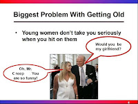

# Sharing while minding the price of shame

*Published 2017-10-20, updated 2018-12-26 · Labels: Public Speaking*  
*Source: <https://visible-quality.blogspot.com/2017/10/sharing-while-minding-price-of-shame.html>*

---

Some weeks ago, I was sitting at the London Heathrow airport, with a little post-it note in front of me saying "review, write, finalize". I had three separate writing assignments waiting for dealing with, and what would be a better place to deal with writing than being stuck at airport or a plane. I started with the review, to an article that is now posted and still causing buzz on my twitter feed: [Cassandra Leung's account of power misuse in the testing community by Mr Creep](http://www.cassandrahl.com/blog/working-while-female-sexual-harassment-in-technology-testing/).  
  
Reading it made me immediately realize I knew who Mr Creep was, and that I had tolerated his inappropriateness in a different scale just so that I could speak at his conferences. I knew that with who I was now, I was safe. I had the privilege of thinking his behavior was disgusting and yet tolerating it. Reading the experience through the eyes of someone with less privilege was painful.  
  
I could do something. So I talked to this Mr Creep's boss. They did all the rest. Shortly after, I saw *this* Mr Creep changing his status for in LinkedIn to Looking for new opportunities. I can only hope that the consequences of his own actions would make him realize how inappropriate they were. And that he would learn new ways of thinking and acting. At least, he no longer is in *this* position of power. He's still an international speaker. Hopefully he is no longer the person who thinks this slide is funny:   
  

This slide happened years ago. We did not realize what it could mean for the women in the community. While the source of this is *this* Mr Creep, there's other creepy "funny" slides with exclusive impact. Don't be Mr Creep when you present.

The article that started this for me came out later. At time of publishing, the proper reaction from the conference was already a fact, making this article very special amongst all the accounts of creepy behavior. This Mr Creep remains unnamed. And I believe that is how it should be. In the era where a lot of our easy access to power comes through social media, there are kinder forms of displaying power and expressing inappropriateness. Bullying the bully or harassing the harasser are not real options. For a powerful message on the price of shame, listen to a [TED talk by Monica Lewinsky.](https://www.ted.com/talks/monica_lewinsky_the_price_of_shame)  
  
Calls like this are also common:  
> I find that more and more I feel that MrCreep should be fully outed. I do at the same time understand many good reasons why not to.
>
> — Ron Jeffries (@RonJeffries) [October 19, 2017](https://twitter.com/RonJeffries/status/921056448863404032?ref_src=twsrc%5Etfw)

Outing him could be necessary if we didn't know he was already addressed. But all too late.  
  
There's been a number of women who have also come forward (naming in private) with their own experiences with Mr Creep in the testing community, some with exact same pattern. Others shared how they always said no to conference speaking in places associated with him. And the message of how unsafe even one Mr Creep could make things for women became more pronounced.  
  
In the last days of me thinking of writing this article, my motives were questioned: maybe I just want to claim the credit for action? But there is a bigger reason that won't leave me alone before I write this:  
  
I need to let other women know that they have the power to make a difference. When it appears that organizations will prioritize their own, sometimes they prioritize their community. They need someone to come forward. If you've been the victim, you don't need to come forward alone. Coming forward via proxy is what we started with here. And after creating the feeling of safety, we brought down the proxy structure giving power where it belongs - back with the victim.  
  
I need to let other women know that the conference we've talked about in hushed voices has chances of again being a safe place for us to speak at.  
  
I need to let the everyone know that seeing all male lineups may mean that all the women chose to stay safe and not go.  
  
I was in a position of privilege to take the message forward. I was an invited international speaker, with an open invitation to future conferences I was ready to drop. I had a platform that gave me power I don't always have. But most of all, I couldn't let this be. I had to see our options.  
  
While what I did was one discussion of someone else's experience, it drained me. It left me in a place where I couldn't speak of my experience as part of this. It left me with guilt, second guessing if other people's choices of boycotting would really have been an option. It left me with fear that Mr Creep targets his upset on me (haven't seen that so far). But most of all, it fill me with regrets as I now know that I could have made choices of addressing the problem a lot earlier.  
  
Mr Creep had to hurt one more person before I was ready to step up. Mr Creep got to exist while I had something I could personally lose on outing him or confronting him on any of his behaviors.  
  
I need to write this article to move forward, and start my own recovery. *This* Mr Creep is one person, and there's many more like that around. Let's just calling out inappropriateness while considering the appropriate channels.
