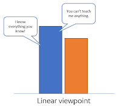
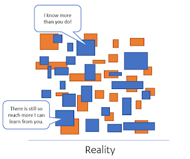

# Why defining a conference talk level means nothing

*Published 2017-12-01, updated 2018-12-26*  
*Source: <https://visible-quality.blogspot.com/2017/12/why-defining-conference-talk-level.html>*

---

Some weeks back, unlike my usual commitment to follow my immediate energy, I made a blogging commitment:  
> I believe concepts like ‘beginner’ or ‘advanced’ in conference sessions should stop. All advanced have different foundation.
>
> — Maaret Pyhäjärvi (@maaretp) [November 15, 2017](https://twitter.com/maaretp/status/930830694296834048?ref_src=twsrc%5Etfw)

 The commitment almost slipped, only to be rescued today by Fiona Charles saying the exact same thing. So now I just get to follow my energy on saying what I feel needs to be said.  
  
**Background**  
   
As you submit a talk proposal, there's all these fields to fill in. One of the fields is one that asks the level of the talk. The level then appears later as a color coding on the program, suggesting to be the among three most important information people use to select sessions. The other important bits are the speaker name (which only matters if the speaker is famous) and the talk title. On how to deal with  talk titles, you might want to [check out the advice](http://europeantestingconference.blogspot.fi/2017/10/talk-titles.html)in European Testing Conference blog.  
  
The beginner/intermediate/advanced talk split comes in many forms. Nordic Testing Days in particular caught my eye with the "like fish in the sea", "tipping your toes" metaphoric approach, but it is still the same concept.   
  
**The problem**  
  
To believe concepts like beginner/intermediate/advanced talklevels are useful, you need to believe that we compare people in a topic like this.  

This same belief system is what we often need to talk about when we talk about imposter syndrome - we think knowledge and skill is linearly comparable, when it actually isn't.  
  
**The solution**  
  
We need to think of knowledge and skills we teach differently - as a multi-dimensional field.  
  

Every expert has more to learn and every novice has things to teach. When we understand that knowing things and applying things isn't linear, we get to appreciate that every single interaction can teach us things. It could encourage the "juniors" to be less apologetic. It could encourage the "intermediate" to feel like they are already sufficient at something even if not everything. And it could fix the "experts" attitudes towards juniors where interaction is approached with preaching and debate, over dialog with the idea of the expert learning from the junior just as much as the other way around.  
  
**So, the conference sessions....**  
  
I believe the best conference sessions even on advanced topics are intended for basic audiences. This is because expertise isn't shared. We don't have a shared foundation. Two experts are not the same.  
  
It's not about targeting to beginner / advanced, it's about building a talk on a relevant topic so that it speaks to a multi-dimensional audience.  
  
As someone with 23 years of industry experience, even my basic talks have some depth others don't. And my advanced talks are very basic, as I need to drag entire audiences to complex ideas like never writing a bug report again in their tester career.  
  
We need more good talks that are digestible for varied audiences, less of random labeling for the level of the talk. In other words, all great talks are for beginners. We're all beginners in the others perspective.
