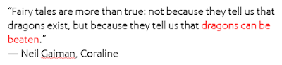

# Becoming a Feedback Fairy

*Published 2017-12-07, updated 2018-12-26 · Labels: Public Speaking*  
*Source: <https://visible-quality.blogspot.com/2017/12/becoming-feedback-fairy.html>*

---

Late in the evening of a speakers' dinner at CraftConf 2017, I met a new person. He was a speaker, just like me, except that when he asked on what I would speak on, he used the words: "Explain it to me like I am not in this field, and I don't understand all the lingo".  
  
I remember not having the words. But this little encounter with a man I can't even name made it into my talk the next day when I first time introduced myself in a new way:  
  
"I'm Maaret and I'm a feedback fairy. It means that I use my magical powers (testing skills) to bring around the gift of deep and thoughtful feedback on the applications we build and the ways we build them. I do this on time for us to react, and with a smile on my face."  
  
That little encounter coined something I had already been coming to from other ends. There were two other, prior events that had also their impact.  
  
At DevOxx conference some time ago, I did a talk about Learning Programming. Someone in the audience gave me feedback, explaining that they liked my talk. The positive feedback as it was phrased made an impact, as they expressed that they'd ask me to be their godmother, unless that place was already up for grabs for J.K. Rowlings. As a dedicated Harry Potter fan, being next on anything from J.K. Rowlings is probably the nicest thing anyone can say.  
  
As I received this feedback, I shared it with the women in testing group, and a new friend in the group picked it up. As I was doing my first ever open conference international keynote, she brought me a gift you can nowadays see in my twitter background: a fairy godmother doll, to remind me of my true powers.  
  
For the Ministry of Testing Masterclass this week, I again introduced myself as a feedback fairy.

> I’d love to be a Feedback Fairy like [@maaretp](https://twitter.com/maaretp?ref_src=twsrc%5Etfw) 💜👩🏻‍💻 [@ministryoftest](https://twitter.com/ministryoftest?ref_src=twsrc%5Etfw) [@Singsalad](https://twitter.com/Singsalad?ref_src=twsrc%5Etfw)
>
> — Deborah Lee (@DeborahLee89) [December 5, 2017](https://twitter.com/DeborahLee89/status/938150134533316608?ref_src=twsrc%5Etfw)

You can be a feedback fairy too, or whatever helps you communicate what you do. There's an upside on being a magical creature: I don't have to live to the rules set by the mortals.    
  

