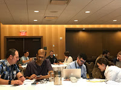

# So, you're a consultant?

*Published 2018-05-01, updated 2018-12-26 · Labels: Public Speaking*  
*Source: <https://visible-quality.blogspot.com/2018/05/so-youre-consultant.html>*

---

I had just finished teaching a half-day training on Exploratory Testing at StarEast. The group was lovely and focused, 18 individuals with different backgrounds and experiences.  
  

*Group on my StarEast Tutorial*

We were just about to start a speed meeting event, and I talked with someone I had not met before. They saw that I had a speaker badge, and asked immediately: "So, you're a consultant?". I looked puzzled for a moment before I explained, like so many times before that I was a tester in a team, that majority of my working days went into testing with a wonderful team and delivering features to production on pretty much a continuous cadence.

The question, however, crossed a personal threshold. It was that one too many to think that I wasn't out of place and fighting against the stream. The default setting was to be a consultant, not an employee in a product development company. It was yet another one of those things that made me happy that I had decided to stop speaking at conferences for now.

Being a consultant is a great thing. But consultants are a different species. They are more self-certain. They're ok being always on the road. They often live off their analysis of other people's work. They carry a risk that I can only admire they cope with, believing there will be more clients. They get different value out of doing (usually an unpaid) talk at a conference because they have something to sell.

I'm here because I have a strong need to sharing what I have learned, in hopes of finding people who can help me accelerate my learning. I'm not a consultant, but I care. And I'm particularly lucky in being non-consultant with an employer who truly supports me doing this as long as I want to do it. It's just that I no longer really want the travel. Maybe again when my kids are past their teenage years. Meanwhile, my helping presence is online, not in conferences.
