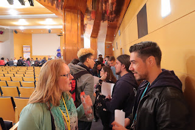

# European Testing Conference SpeedMeet - How To?

*Published 2019-02-18*  
*Source: <https://visible-quality.blogspot.com/2019/02/european-testing-conference-speedmeet.html>*

---

Picture a conference you went to, alone. You don't know anyone, not sure if they want to talk about exploratory testing (your favorite) or test automation (not your favorite) and not feeling like you have the energy to go and push yourself on random strangers. You show up, sit in a table, watching people around you discuss and listen until it is again time to head to a session.  
  
As a socially anxious extrovert, I have had huge problems with conferences. I want to talk to people,  but the need of taking the first step and finding out *if they want to talk to me* drains me. My usual recipe is to be a speaker, and have people approach me. But the same issue drove me to figure out other designs for my conference, and SpeedMeet was born.  
  
SpeedMeet puts together three insights:  

- Pairing people up with a rule to introduce is an effective way of building relationships. The rule helped people at Scan Agile meet, and we wanted to do more of sessions where social interaction wasn't emergent but facilitated.
- The meeting needs an artifact that introduced pull over push in introductions. This piece we found in Jurgen Appelo's talk in Agile Serbia, and combining it my personal aversion to talking about beer (push information often provided in the tester community), the connection to the right dynamic was evident.
- The high-volume high-interaction event needs an escape route and permission. This piece became evident with experimenting with large crowds listening to feedback.

So how does this work?  

1. **Mindmap**  
   Create a mindmap about stuff you would want to say if you got to introduce yourself. Usual triggers we use to help people figure this out is mapping three 2nd level nodes with titles "Personal", "Work", "In the last year" or "I want to learn" and "I want to teach". This map needs to be available for you when joining the session.
2. **Shared space - standing up or loose rows of chairs**  
   Join the space for speed meet, and find a pair. We would have two rows of people, either standing up or sitting down. The first one across you is your first person you will get to know.
3. **Opening the session**  
   Before people start talking (and volume goes up), explain what we are doing. Explain we switch pairs every 5 minutes. Have people practice everyone moving one to the right and getting to a new pair. Explain that you are not allowed to say a thing without the other asking you based on looking at stuff they want to talk on in their mindmap.
4. **Timing and rotation**   
   You may want to practice this. Everyone moves to their right. This means you get to talk to every second person in the line. We find 5 minutes is a good time for mutual discussion starter and is enough to know if this person is someone you want to continue with over lunch and the rest of the conference. It still gives you chances of finding the right person(s) for you by meeting 7-8 people in 45 minute session.
5. **Pull information from the map**  
   Don't use the map to introduce yourself. Physically hand the artifact over the the other one who can read your mindmap and ask questions they want to know of. This avoids having awkward discussions on topics that are not mutually shared and extroverted people doing a lecture on their person. You can control what information you pull. If you see "2 kids" and don't want to talk of kids, don't. Select something you are comfortable having a conversation about. Take turns on each others map pulling piece by piece.
6. **Leave whenever**  
   If you feel overwhelmed and want to step out, it is easily possible at time of switching partners. Just step out, and relax. You are in control.

For European Testing Conference, we have done this activity now for three years. This activity opens  the sharing and networking nature of the conference and sets the bubbly discussion tone. You will meet people here. Everyone is with everyone. And if you know a little about someone, continuing from there is a lot easier. The activity does some of that heavy lifting for you - just play by the rules, and manage your own energy level by stepping out if your interaction limit is reached.
