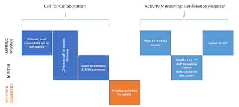

# A New Style for Conference Speaker Intake: Call for Collaboration

*Published 2019-12-05*  
*Source: <https://visible-quality.blogspot.com/2019/12/a-new-style-for-conference-speaker.html>*

---

Drawing from a personal experience as conference speaker and conference organizer wanting to see change in how conference speakers are selected, I have been experimenting with something completely different.

The usual way for conferences to find their speakers are casting two nets:

- Invite people you know
- Invite everyone to submit to call for proposals/papers (CfP) and select based on the written submission

Inviting works with people with name and fame. If you want to find new voices with brilliant stories from the trenches, the likelihood of you now knowing all  those people (yet) is quite high. Asking them to announce themselves makes sense.  
  
This way of how a speaker announces their existence to conference is where I have discovered a completely new way of dealing with submissions creates a difference.  
  
**What is a Call for Proposals/Papers**   
  
In the usual world of announcing you might be interested in speaking in a conference, you respond to a Call for Proposals/Papers. The Papers version is what you would expect in more academically oriented conferences, and the paper they mean is usually an 8-page document explaining result of years of research. The Proposals version is what you would expect in a more industry-oriented conference, and the proposal is a title, 200-words abstract and 200-words bio of yourself, and whatever other information a particular conference feels they want to see you write that would help them make selections.  
  
While speaking in public is about getting in front of a crowd to share, conference CfPs are about writing. The way I think of it is that writing is a gate-keeping mechanism to speaking in conferences.  
  
As a new speaker, learning to write in this particular style to be accepted may be harder than getting on that stage and delivering your lessons by speaking about them. At the very least, it is different set of skills.  
  
In my experiences in working to increase new voices and diversity at conferences, there are two things that most get in the way:  

1. **Finances** - underrepresented groups find it harder to finance their travel if conference does not address that
2. **Writing to the audience** - unrehearsed people don't write great texts of their great talk ideas. Many feel the writing to be a task so overwhelming they don't submit.

Conferences try to help people in multiple ways, usually seeking writing based ways. It is fairly common to expect a conference to provide *some* feedback on your written text, especially when using supportive submission systems where you then improve your text based on feedback. But the edits are usually minor even when you could frame your talk different to make it better presented. Many ask for speaking samples (videos), adding to the work expected on the competition towards a conference speaking slot. Some conferences shortlist proposals and then call people, to ensure the speaking matches the writing. Some conferences realize after selection you could use help and call mentors like myself to help bring out the better delivery of an already great idea.  
  
**What is a Call for Collaboration**  
  
Call for Collaboration is a submission process I have been discovering for the last five years, coming to terms with my discomfort on choosing a speaker based on *writing* instead of *speaking*. I have felt I don't appreciate the purely competitive approach of writing for a CfP to win a speaking slot, and wanted to find something different.  
  
Call for Collaboration is about aspiring speakers announcing their existence and collaborating on creating that proposal. It's a process where the conference representatives invest online face to face time to getting to know great people they could invite. And it's a process where the investment from the speaker side is smaller, creating less waste in case of not fitting the scarce conference slots. It's a human-human process where people speak and instead of assessing we build the best possible proposal from whatever the aspiring speaker comes in with.   

In Call for Collaboration (CfC), we appreciate that every voice and story belongs on a stage, and making the story the best form of itself increases it chances to this conference, but has a ripple effect of improving it for other conferences too.  
  
This submission process was first created for European Testing Conference, and later used for TechVoices track for Agile Testing Days USA 2018 and 2019, and TechVoices keynote for Selenium Conference London. So far I have done about 500 15-minute calls over the years of discovering this.   

**How Does This Work?**

It all starts with an aspiring speaker thinking they want to make their existence and idea known for a particular Call for Collaboration a conference kicks off and being willing to invest 15 minutes of their life to have a discussion about a talk idea they have.

Image. TechVoices version of CfC + Activity Mentoring

***Schedule a Call***   
  
To announce their existence, they get a link created with Calendly that shows 15-minute timeslots available to schedule.  
  
Behind the scenes, a conference representative has connected Calendly to their calendar knowing when they are not available and defined time frames when they accept calls and limits to numbers of calls per day. They can define questions they want answered, and I usually go for minimum:  

- Your talk's working title
- Optional abstract if you want to pass us one already
- Your pronouns

Each call from a conference representative perspective is 15 minutes, like a coffee break. It includes taking an online call to someone anywhere in the world and meeting someone awesome.  
  
If the aspiring speaker has something come up, they can reschedule with Calendly. Calendly also handles timezones so that both parties end up expecting the same time - at least if you have the tool create a calendar appointment for you.  
  
***Show Up for the Call***  
  
The 15-minute call is for collaboration. It starts with establishing we don't need to discuss credentials but just the talk idea and that everyone is awesome. We are not here to drop people away from the conference, but to understand the world of options and make this particular option shine, together.  
  
It continues with the aspiring speaker telling how they see their talk: what is it about, what they teach and what the audience would get from that.  
  
The usual questions to ask are on "Would you have an example of this?" and "What is your current idea of how you would illustrate this?" or on "Have you considered who is your audience?" or "Why should people care about this?" or "We know you should be talking of this, but how would you tell that to people who don't know it yet and have many options in similar topics?".  
  
I have had people come to the call with the whole story of their life in agile, and leave with one concrete idea of what they are uniquely able to teach. There are talks in this world that exist because they were discovered through these 15-minute discussions.   
  
For some of the calls, we've had a whole group of people from the conference - this serves as a great way of teaching the mechanism further - mentoring the mentors to take the right mindset. We are there to build up the speaker and idea, not to test it for possible problems.   
  
***Share to the World***  
  
In the end of the call, the conference representative asks for
permission to summarize what they  learned about the talk in a tweet
with reference to the aspiring speaker, and with permission share that.
Sharing serves three purposes: it helps remember what the talk was about
(to prioritize for invitation to work on the talk further); it allows
the aspiring speaker to confirm if their core message was heard and to
correct; and it creates a connection for the aspiring speaker to other
people interested of this theme in the community.  
  
***Prioritize to Invite***  

Now we are at a point where there isn't really an abstract, but there is a tweet and there are the lessons of what the abstract could be about from the aspiring speaker to the conference representative. We can make a selection based on how people speak in that call, and particularly, what unique content they would bring to that conference.  
  
If  someone isn't quite there yet on how they deliver their message, we can invite them and ask them to pair up with an activity mentor for rehearsing the talk. This is the only way to  get some of the unique new experiences from people who are not accustomed to speak in public. With rehearsing, people can do it. The only concern around rehearsing I have sometimes is on English skills - I have mentored people who would either need a translator (used a translator in our call) or a few more years of spoken English.   
  
This is a point where you have usually used about same effort on the person as you would if you were carefully reading their written abstract - but you might have now a different talk to consider as a result of the collaboration.   
  
If you invite, the next step is needing the abstract for the conference program. Or, it could be that this is the abstract use for yet another round of selections if you want to pin this process on a more traditional CfP.  
  
**Activity Mentoring for Conference Proposal - What Is This?**  

The activity of creating that title, abstract and bio to show the best side of the talk is the next part. The newer the speaker, the harder this is to get right without help. A natural continuation of CfC is activity mentoring, ensuring the written test as a deliverable of the process reflects the greatness of the talk.   

- **1st draft**  is what comes out of the aspiring speaker without particularly trying to optimize for correctness. It is good to set up expectations, but also encourage: something is better than nothing. This is just a start.
- **2nd draft** is what comes our when the conference representative from the call puts together 1st draft, their notes on what the talk is about, the tweet they summarized things into and their expertise on abstracts. Its usually an exercise of copypasting together my notes of their spoken words and their written words in an enhanced format.
- **Submission** is what the conference system sees, and it is an improved version of 2nd draft.

**Example**  
  
The latest effort from this process will be soon published as the TechVoices Track of Agile Testing Days USA 2020. 9 speakers with stories from new speakers that are not available without taking the effort to get to know the people. Many of these voices would not be available if the choice was done on what they wrote alone. Every single one of these voices is something I look forward to, and they teach us unique perspectives.  
  
I still have another activity  mentoring period ahead of me with a chance of hearing the premiers of these talks before conference and helping them shine with yet another round of feedback  
  
We chose 9 talks out of 45 proposals invited from USA, South America and Canada. I also had a few calls with ideas from people not from invited geographies and helped them figure out their talks in the same 15 minute slots.   
  
As a mentor, I had time to talk to all of these people and feel privileged to having had the chance of hearing their stories and tell about their existence through tweets. I would not have had time to help all of them get the proposals to a shape where they could get accepted to the conference. The activity mentoring is a focus draining activity, whereas having a call is more easily time-boxed and happens without special efforts.  
  
I spent 11 hours over timeframe of a month talking to people and getting to know them. I spent another 10 hours on the 9 people that were selected.   
  
The hours the 15-minute slots make have been the best possible testing awareness training I could have personally received. It has given me a lot of perspective, and made me someone who can drop names and topics for conferences that have a more traditional Call for Proposals.
