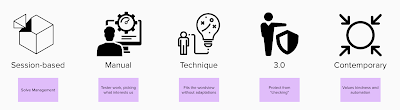

# There are Plenty of Ways to Talk about Exploratory Testing

*Published 2021-09-19*  
*Source: <https://visible-quality.blogspot.com/2021/09/there-are-plenty-of-ways-to-talk-about.html>*

---

Out of all things Ministry of Testing, I am part of a very small corner. I speak at the independent meetups even when they fly under that flag, I speak at their sessions if they invite me (which they don't), and I am a silent lurker on a single channel, exploratory-testing, on their slack. Lurking provided me a piece of inspiration today, [an article from Jamaal Todd](https://qatoddy.medium.com/exploratory-testing-the-results-are-in-quickread-169c16dbd3b1).

Jamaal asked LinkedIn and Reddit about **Exploratory Testing**to learn that less than 10 % of his respondents don't do exploratory testing, 50-70% give it a resounding yes and there's a fair portion of people who find it at least sometimes worth doing out of the 400 people taking time to click on the polls.

What Jamaal's article taught me is that a lot of people recognize it as something of value, and it surprised me a little bit. After all as we can see in the responses by one of the terrible twins of testing in the slack, they are doing a lot of communication around the idea that exploratory testing does not exist.

It exists, it is doing well, and we have plenty of ways to talk about it which can be really confusing.

When I talk of exploratory testing, I frame my things as **Contemporary Exploratory Testing**. The main difference in how I talk about it is that it *includes test automation*. Your automated tests call you to explore when they fail, and they are a platform from which you can add power to your exploration. Some of them even do part of the exploration for you.

Not everyone thinks of exploratory testing this way. The testing communities tried labeling different ideas a few decades ago with "schools of testing", and we are still hurting from that effort. When the person assigning others labels does so to promote their own true way, the other labels appear dismissive. "Context-driven" sounds active, intentional. But "Factory" is offensive.

One of the many things I have learned on programming that naming is one of the hard problems. And a lot of times we try to think in terms of nailing the name early on, whereas we can go about and rename things as we learn their true essence. Instead of stopping to think about the best name, start with some name, and refactor.

So, we have plenty of ways to talk about exploratory testing, what are they?

1. **Contemporary Exploratory testing**. It includes automation. Programming is non-negotiable but programming is created from smart people. The reason we don't automate (yet) is that we are ramping up skills.
2. **3.0 Exploratory testing**. It does not exist. There is only testing. And the non-exploratory part we want to call 'checking', mostly to manage the concern that people don't think well while they focus on automation. Also known as RST - Rapid Software Testing. It is all exploratory testing.
3. **Technique Exploratory Testing**. We think of all things we have names for, and yet there is something in testing that we need to do to find the bugs everything else misses. That we call exploratory testing. Managing this technique by sessions of freedom is a convenient way to package the technique.
4. **Manual Exploratory Testing**. It's what testers who don't code do. Essential part of defining it is that automation is not it, usually motivated by testers who have their hands full of valuable work already now without automation.
5. **Session-based Exploratory Testing**. Without management with sessions exploratory testing isn't disciplined and structured. Focus on planning frequently what we use time on and ensure there is enough documentation to satisfy the organization's documentation needs we aren't allowed to renegotiate.

Lets start with these. Every piece of writing there is on exploratory testing falls into one of these beliefs. The thing is, all that writing is useful and worth reading. It's not about one of these being better, but about you being able to make sense in the idea that NOTHING is one thing when people are involved.

I invite you all to join the conversation on all kinds of exploratory testing at Exploratory Testing Slack. Link is available with main page of [Exploratory Testing Academy](https://www.exploratorytestingacademy.com).
