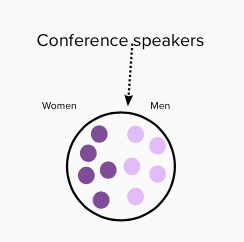
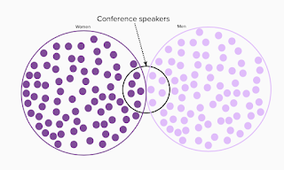
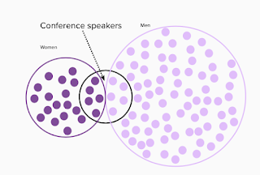

# Balancing the Speaker Circuit

*Published 2021-11-21*  
*Source: <https://visible-quality.blogspot.com/2021/11/balancing-speaker-circuit.html>*

---

On this lovely Sunday, two different conferences representatives ended up in the things I read, with a very similar message. Both conferences would love to have more women speak, but both also suffer from the same problem - women won't submit.

With this thought on my mind, I browsed further on the random things people share and came by a [visualization on why it is a problem that hospitals have as many vaccinated and unvaccinated people](https://twitter.com/n0rm/status/1462360377702993923?s=20). This lead me to think on the tech conferences problem on equal representation even further.

When the size of population is large enough, a small location such as a conference stage is easy to fill. All you need is five "best people" of your two categories, and your stage is full. With a population large enough, you can't claim that the people you choose while using some helpful categorization aren't the best - you can't have all on display anyway, and for almost any topic that a representative in one group could present, you could find a representative in another group.

This takes us to why it matters. Conferences model the world we expect to have. Every speaker invites speakers who identify with them to feel included - for their topics, for their experiences and for their representation. The world has a little more women than men, and that is what tech of the future should look like. Intelligence is distributed in the world, and we want to bring in intelligent people to contribute in tech.

The current reality we source our speakers from, however, is the current tech industry where we still have a lot more men than women. And with this dynamic, it means there is extra work included in being part of the minority group. We still have plenty of people in both groups to choose from, but the majority group uses less energy in just existing and thus has more energy to exert in putting themselves forward.

  

Expecting equal showing up for people in both groups to respond to call for proposals, would expect existing was equally laborious.

While we don't have equality, we need equity - particularly reaching out to the minority group so that we can have a balanced representation. We shouldn't choosing the "best out of people who did the free work for us" in CFP, we should be choosing best lessons our paying audiences benefit from in creating the software of the future.

They say that they won't come to your home to find you, but with power of networks, we could easily source the people - both men and women - from the companies doing the work and thus qualified to share the work without making the people themselves to do the work of submitting to a call for proposal.

With 465 talks under my belt, I still get rarely paid for teaching I do from all the stages. But the longer I am at this, the more I require that the conferences who won't pay for my work do their own work of reaching out for a balanced representation. I'm personally not available without an invitation and consider the invitation a significant part of not having to invest quite so much into speaking. But I think this is true to people who need the extra step of inviting to feel welcome, and to dare to consider taking the stage.

Find the ones who aren't in current speaker circulation, and invite them. Nothing less is sufficient in this time of connectedness.
