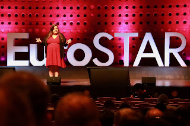
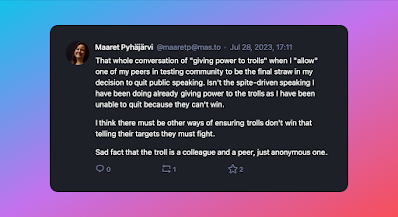

# Public Speaking Closure

*Published 2023-07-29*  
*Source: <https://visible-quality.blogspot.com/2023/07/public-speaking-closure.html>*

---

Very long time ago, like three decades ago, I applied for a job I wanted in the student union. Most of the work in that space is volunteer-based and not paid, but there are few key positions that hold the organizations together, and the position I aspired to have was one of those.

As part of the process of applying, I had to tell about myself on a large lecture hall, with some tens of people in the audience. I felt physically sick, remember nothing of what come out of my mouth, had my legs so shaky I had hard time standing and probably managed to just about say my name from that stage. It became obvious if I had not given it credit before: my fear of public speaking was going to be a blocker on things I might want to do.

I did not get the job, nor do I know whether it was how awful my public speaking was or if it was my absolute lack of ability to tell jokes intentionally or some of many other good reasons, but I can still remember how I felt on that stage on that day. I can also remember the spite that drove me on taking actions since then and over time gave sense of purpose for many actions to be educated and practice the skills related to public speaking.

Somewhere along the line, I got over the fear and had done talks and trainings in the hundreds. Then a EuroSTAR program chair of the year decided to reflect on why he chose no women to keynote quoting "No women of merit", and I found spite-driven development to become a woman of merit to keynote. I did my second EuroSTAR keynote this June.

  

Over the years of speaking, I learned that the motivations or personal benefits to a speaker getting on those stages are as diverse as the speakers. I was first motivated by a personal development need, getting over a fear that would impact my future. Then I was motivated by learning from people who would come and discuss topics I was speaking about, as I still suffer from a particular brand of social anxiety on small talk and opening conversations with strangers. But I collected status, I lost a lot of that value with people thinking they needed something really special to start a conversation with me. I travelled the world experiencing panic attacks and felt sometimes the loneliest in big crowds and conferences, with all those extroverts without my limitations. In recent years, I find I have been speaking because I know my lessons from doing this - not consulting on this - are relevant and speaking gives me a reflection mechanism of how things are changing as I learn. However, it has been a while since getting on that stage has felt like a worthwhile investment.

Recently, I have been speaking on habit and policy. I don't submit talks on call for proposals, and I have used that policy to illustrate that not having women speakers is conference organizers choice as many people like myself will say yes to an invitation. The wasteful practice of preparing talks when we really should be collaborating is something I feel strongly on, still today. The money from speaking from stages isn't relevant, the money from trainings is. In last three years with Vaisala, I have had all the teams in the whole company to consult at will and availability, and I have not even wanted to make the time for all of the other organizations even though I still have a side business permission. I just love the work I have there where I have effectively already had four different positions within one due to the flexibility they built for me. Being away to travel to a conference feels a lot more like a stretch and significant investment that is at odds with other things I want to do.

The final straw to change my policy I got from EuroSTAR feedback. In a group of my peers giving anonymous feedback, someone chose to give me feedback beyond the talk I delivered. I am ok with feedback that my talk today was shit. But the feedback did not stop there. It also made a point that all of my talks are shit. And that the feedback giver could not understand why people would let me on a stage. That has hateful and we call people like this trolls when they hide behind anonymity. However, this troll is a colleague, a fellow test conference goer.

Reflecting my boundaries and my aspirations, I decided: I retire from public speaking, delivering the talks I have already committed to but changing my default to invitations to No. I have done 9 No responses since the resolution, and I expect to be asked now less since I have announced unavailability.

It frees time for other things. And it tells you all that would have wanted to learn from me that you need to reign in the trolls sitting in you and amongst you. I sit in my power of choice, and quit with 527 sessions, adding only paid trainings on my list of delivered things for now.

I'm very lucky and privileged to be able to choose this as speaking has never been my work. It was always something I did because I felt there are people who would want to learn from what I had to offer from a stage. Now I have more time for 1:1 conversations where we both learn.

I will be doing more collaborative learning and benchmarking. More writing. Coding an app and maybe starting a business on it. Writing whenever I feel like it to give access to my experiences. Hanging out with people who are not trolls to me, working to have less trolls by removing structures that enable them. Swimming and dancing. Something Selenium related in the community. The list is long, and it's not my loss to not get on those stages - it's a loss for some people in the audiences. I am already a woman of merit, and there's plenty more of us to fill the keynote stages for me to be proud of.

