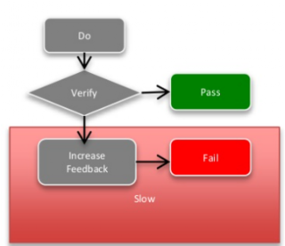

# Unit testing is about Asserts

*Published 2015-10-12, updated 2017-07-23 · Labels: Approval Testing*  
*Source: <https://visible-quality.blogspot.com/2015/10/unit-testing-is-about-asserts.html>*

---

There's this weird state of mind that I'm in with Unit Testing. I read unit tests, I talk about unit tests but I rarely write any. But I've been around them enough to start to think I'm recognizing some patterns there, and know when stuff I'm being suggested is useful / good and not.  
  
Last week, one of my teams had a Unit Testing -training. My motivations to participate were two-fold. I was really curious why they had set learning unit testing as their target (now that they no longer have a professional tester working with them, the rumor is that they might be struggling more with delivery quality). I also wanted to see how the new training company was doing on the topic.  
  
Out of the three hours, we spent two with theory and one with hands-on work. The theory was the usual stuff: refactor to find functional bits you can test. Isolate the bits that make it hard for you and leave them out of your tests. We also looked at my team's tests, without a single good example. There was a lot of bad out there.  
  
The hands on work focused on removing need of profiler in the tests. We had been heavy on mocking with JustMock, that made testing possible, but to an extent it made tests slow doing some things for us that weren't needed. So we were removing dependencies on Profiler.  
  
While looking at the examples and the tests we were trying to change, my eyes kept going to the asserts in the tests. That's where the bit of testing with the tests happen. And I could not help but noticing how weak the asserts were. I had been primed for paying attention to that.  
  
To start the same week, I had just listened to a talk by [Llewellyn Falco](http://twitter.com/LlewellynFalco) titled ["Common Path for Approval Testing - patterns for more more powerful asserts"](http://www.slideshare.net/llewellynfalco/approval-testing-from-basic-to-advanced). Perhaps that is why I made the connection: all of the asserts I was seeing were the first step. We would assert numbers and boolean values for existence. Nothing more advanced. Nothing more *meaningful.* And asserting simple things is simple, but leaves a lot to hope for in the perspective of actually noticing that things break. And when they break, being able to analyze what is going on. The picture introducing step 6 (Diff tools), doing things on failure that can be slow but happen only on items that fail was an eye-opener to me.  

With all of this, I was left to wonder. Having weak tests that run faster cannot be the goal we should be having. When there's many things to work on, how do teams really end up making their choices of what to start from? This choice, looking from a tester perspective, just makes little sense. If testing happens somewhere in the unit tests, the asserts seem like a place to pay attention to. Thus I'm very drawn to the idea of making them more powerful.
