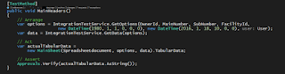
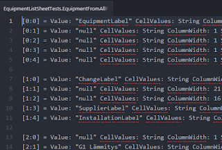
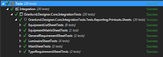

# The Integration ApprovalTests

*Published 2016-09-02, updated 2017-07-23 · Labels: Approval Testing*  
*Source: <https://visible-quality.blogspot.com/2016/09/the-integration-approvaltests.html>*

---

With my last day at Granlund, I want to share one of the proud moments we've had here with  my team with our test automation efforts.  
  
Unit testing was never easy for us. With all the people in *agile* conferences talking about unit testing as if it is the most natural thing any developer could do, I found that either we'reworse than everyone else (I doubt it) or the conference speaker circuit isn't representative. Knowing that many (even most) organizations struggle with unit testing helped.  
  
We did try. I helped developers clear up time from schedules. I found us teachers to do workshops with us. And the project manager would follow some of the numbers very proudly, even reporting them as part of his monthly steering group reports (that never really made sense to me).  
  
I asked about qualitative stuff: how did the developers feel creating and using them, was there examples from this week they could mention where a unit tests helped them and while there were some, it wasn't a very good experience. We addressed the feelings is not knowing what is worth testing, not being able to test things where architecture wasn't built with tests in mind and many more. Over a course of two years, we still kept hitting the same wall: perceived lack of value.  
  
Seeing some agile developers test (TDD), rely and love their tests, it was clear that we were missing something. But TDD did not turn out to be something that could be easily introduced regardless of firm belief (on my part) of its value.  
  
So we added first database checks and created a lot of value through data monitoring. I've written about this before. With architectural change to our printouts (the main thing our end users want out of the system we're producing), there was a chance of driving for API that would enable automated testing of some of the more complicated stuff to test manually.  
  
We separated pushing the data into an excel with formatting functionalities into a layer of its own, and all the functionalities related to getting the right data right was separated. While conceptually the unit testing of all this was still too hard, the idea of testing against the API wasn't. And we used ApprovalTests to make it even more easy.  
  
We created the scenario to test into the database manually using the application, and added an ApprovalTest for each scenario to keep track of getting the right contents back.  
  
With ApprovalTest, the contents got automatically saved onto an .approved -file and formed a golden master - alert us if this changes.  
  

  
We created 20 scenarios and started using them as part of our continuous integration.    
  

  
Over the course of a year we've had these, they have failed for us for reasons. They've saved us many times from side effects none could foresee.  
  
We also have some unit tests with ApprovalTests, in particular with combinations approvals. It might take a moment to understand that your test is the code + the file, but when you do, this makes a lot of sense. And most importantly: it made practical sense for us in a situation where we were not ready for all the great and fancy ideas related to TDD.
