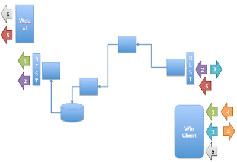

# Thinking in Scopes

*Published 2017-01-14, updated 2017-07-23 · Labels: Test Automation*  
*Source: <https://visible-quality.blogspot.com/2017/01/thinking-in-scopes.html>*

---

The system I'm testing these days is very much a multi-team effort and as an exploratory tester looking particularly into how well our Windows Client works, I find myself often in between all of these teams. I don't really care if works as designed on my component, if the other components are out of synch failing to provide end users the value that was expected.

Working in this, I've started to experience that my stance is more of a rare one. It would appear that most people look very much at the components they are creating, the features they assign to those components and the dependencies upstream or downstream that they recognize. But exploring is all about discovering things I don't necessary recognize, so confirming and feature focus won't really work for me.

To cope with a big multi-team system, I place my main focus on the two end points that users see. There is a web GUI for management purposes, and there's a local windows client. And a lot of things in between, depending on what functionality I have in mind. As an exploratory tester, while I care most for the end-to-end experience, I also care in ways I can make things fail faster with all the components on the way and I have control over all the pieces in between.

I find that the decomposition of things into pieces while caring for the whole chain may not be as common as I'd like it to be amongst my peers. And in particular, amongst my peers who have chosen to pay attention to test automation, from a manual system tester background.

Like me, they care for end to end, but whatever they do, they want to do in means of automation. They build hugely complicated scripts to do very basic things on the client, and are inclined to build hugely complicated scripts to do very basic things on the web ui - a true end-to-end, automated.

There's this almost funny thing for automation that while I'm happy to find problems exploring and then pinpoint them into the right piece, I feel the automation fails if it can't do a better job at pinpointing where the problem is in the first place. It's not just a replacement of what could be done manually while testing, it's also a replacement for the work to do after it fails. Granularity matters.

For automation purposes, decomposing the system into smaller chains responsible for particular functionality gets more important.

I drew a picture of my puzzle.

  

Number 6 is true end-to-end: doing something on a windows client 'like a user', and verifying things on the the web guide 'like a user'. Right now I'm thinking we should have no automated tests in this scope.

Number 1 is almost end to end, because the Web GUI is very thin. Doing something on the windows client and verifying on the same rest services that serve the GUI. This is my team's system automation favored perspective, to an extent that I'm still struggling to introduce any other scopes. When these fails (and that is often), we talk about figuring out in the scope of about 10 teams.

Number 2 is the backend system ownership team's favored testing scope. Simulating the windows client by pushing in the simulated messages in from one REST API and seeing them come out transformed from another REST API. It gives a wide variety of control through simulating all the weird things the client might be sending.

Number 5 is something the backend system ownership team has had in the past. It takes REST API as a point of entry simulating the windows client, but verifying end user perspective with the Web GUI. We're actively lowering the number of these tests, as experimenting with them shows they tend to find same problems as REST to REST but be significantly slower and more brittle.

I'm trying hard right now to introduce scopes 3 and 4. Scope 3 would include tests that verify what ever the windows client is generating against what ever the backend system ownership team is expecting as per their simulated data. Scope 4 would be system testing just on the windows system.

The scopes were always there. They are relevant when exploring. They are just as relevant (if not more relevant) when automating.

The preference to the whole system scope is puzzling me. I think it is learned in the years as "manual system tester" later turned into "system test automation specialist". Decomposing requires deeper understanding of what and how gets built. But it creates a lot better automation.

Telling me there are unit tests, integration tests and system tests just isn't helpful. We need the scopes. Thinking in scopes is important.
