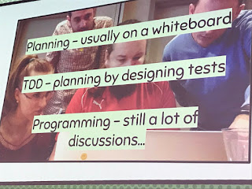

# What makes a test automation expert?

*Published 2017-09-21, updated 2018-12-26 · Labels: Test Automation*  
*Source: <https://visible-quality.blogspot.com/2017/09/what-makes-test-automation-expert.html>*

---

I was part of a working group that created an article called [125 Awesome Testers You Should Keep Your Eye on Always](https://agiletestingdays.com/blog/125-awesome-testers-you-should-keep-your-eye-on-always/). It may not be obvious, but that list is a response to another article called [51 automated testing Experts You Should Keep Your Eye on Always](https://qarea.us/articles/51-automated-testing-experts-you-should-keep-your-eye-always). That list had only four women (at least it had four women!) and let me tell you a big public secret:  
> It is not because there aren't many awesome women in automation. It is because people don't look around and pay attention.

I could have many different criteria on what makes a test automation expert:  

- Speaks about test automation in public (conferences, articles) in a way that others find valuable
- Does epic stuff on making automation work out and do real testing
- Is identified as a creator of a test automation framework or library
- Speaks only of automation and never in a manner that addresses its limits

The 125 awesome testers list does not identify automation separately, because I find that most people contribute to test automation in a significant way. Not all of people in either one of those lists have created an open source tool of their own. Not all people on either one of those lists write test automation code as their main thing.  
  
We can be awesome at automation in so many ways. Writing code alone in a corner is not the only way. Many of us work in teams that collaborate: pair, or even mob. Coding is not the only way to do automation.   

- Delivering insights that are directly transferable to useful test automation is a way of doing automation.
- Working on the automation architecture, defining what we share is a way of doing automation.
- Helping see what we've done through lenses of value in testing is a way of doing automation.
- Reading code without writing a line and commenting on what gets tested is a way of doing automation.
- Pairing and mobbing are ways of doing automation.

We don't say coding is all there is to application development, why would coding be all there is to  test automation development?

There's been a particular experience that has shaped my experience around this a lot, which is working with mob programming.  After programming with 14 different programming languages, I still identified as a non-programmer because my interests were wider. I actively forgot the experience I had, and downplayed it for decades. What changes me was seeing people who are programmers in action. I did not change because I started coding more. I changed because I started seeing that everyone codes so little.

The image below is from a presentation of [Anssi Lehtelä](http://twitter.com/hellofatester), a fellow tester in Finland who has also now two years of mob programming with his team under his belt. A core insight I find we share is that in coding, there is surprisingly little of coding. It's thinking and discussions. And that's what we've always been great at too! And don't forget googling - they google like crazy!

Lists tell you who the list maker follows. Check if you have even a possibility to recognize the awesome women in automation using http://proporti.onl on your twitter feed. It can be brutal. Mine is 53 % women. In the numbers I can follow, there's easily a brilliant, inspirational woman to match every single man. In any topic, including automation. Start hearing more voices.
